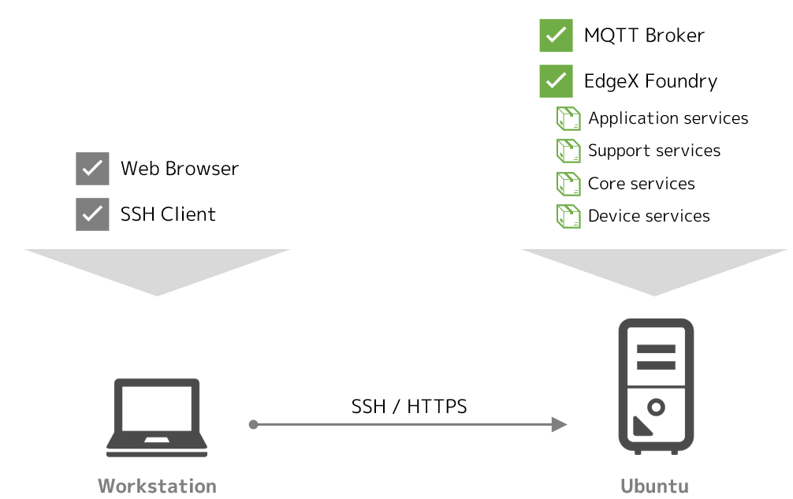
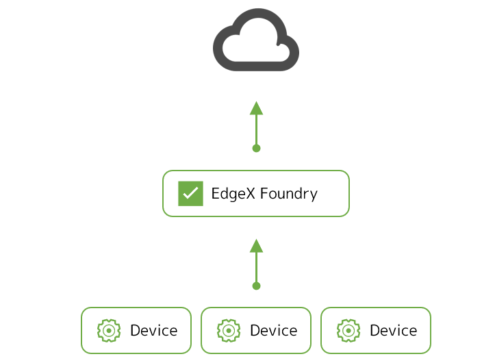
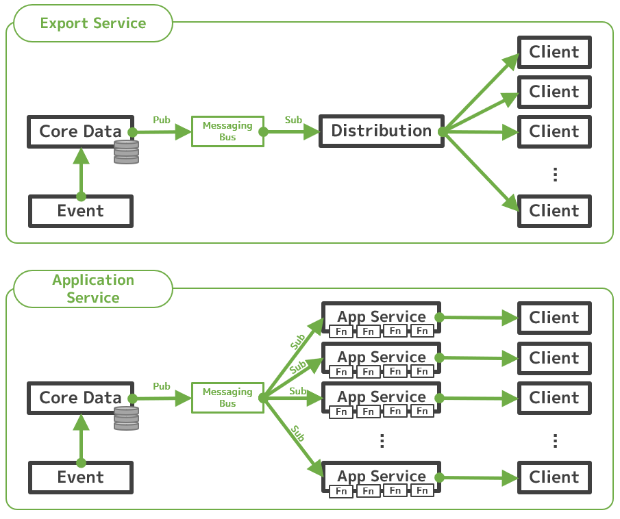
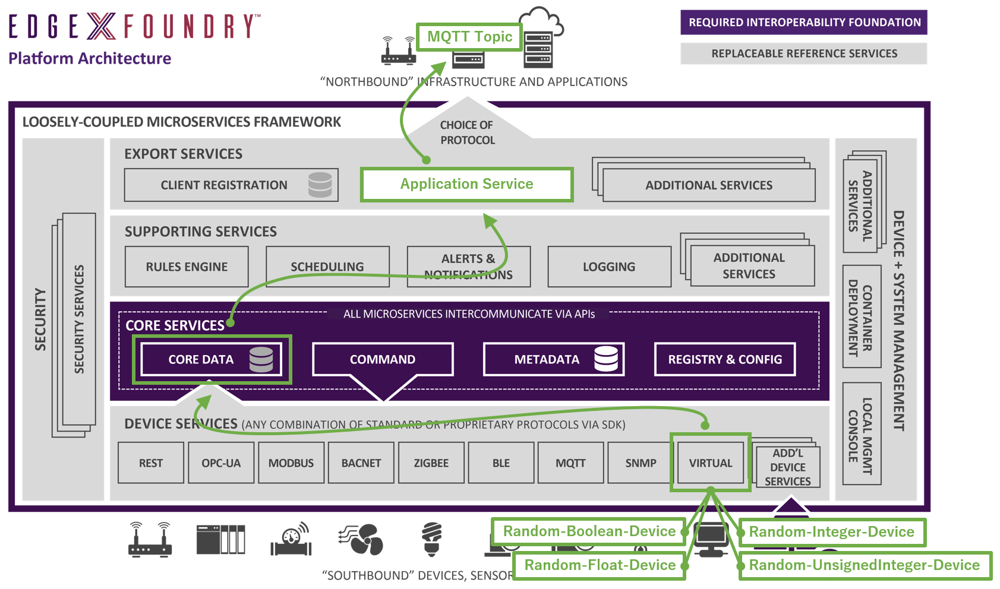
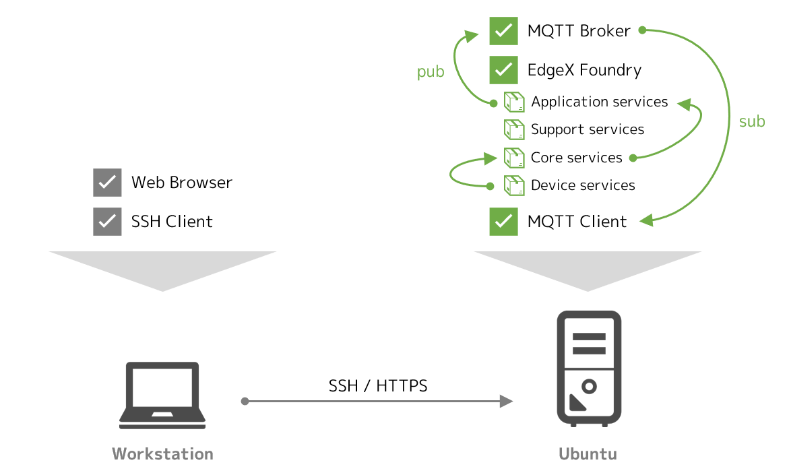

# Lab 4 - Exporting data to MQTT

このラボでは、EdgeX Foundry から、外部の分析基盤などにリアルタイムにデータをエクスポートする手法を実践します。


## このラボのゴールと構成

このラボの目的は次の通りです。

* アプリケーションサービスの概要と考え方を理解する
* アプリケーションサービスを用いて、外部にリアルタイムにデータをエクスポートする手法を理解する

このラボでは、Docker Compose を利用して、Ubuntu 上の Docker コンテナ群として EdgeX Foundry を起動させます。また、エクスポート先の MQTT のブローカも Docker コンテナとして起動させます。




### 必要なファイルの用意

ラボに必要なファイルは、前のラボでクローンしたリポジトリに含まれています。クローンを実施していない場合は、Ubuntu 上でクローンし、CPU のアーキテクチャに応じてディレクトリを移動してください。

=== "amd64"
    ```bash
    git clone https://github.com/kurokobo/edgex-hol-fuji.git
    cd edgex-hol-fuji
    cd amd64
    ```
=== "arm64"
    ```bash
    git clone https://github.com/kurokobo/edgex-hol-fuji.git
    cd edgex-hol-fuji
    cd arm64
    ```

このラボでは、`lab-app-service-export-mqtt` ディレクトリの中身を利用します。

```bash
cd lab-app-service-export-mqtt
ls -l
```

ファイル `docker-compose.yml` と、ディレクトリ `app-service` が存在しているはずです。


## データのエクスポート手段

データのエクスポートの機能は、デバイスから EdgeX Foundry に入ってきたデータを、フィルタなどの処理を施したうえで外部の分析基盤やクラウド環境などにリアルタイムに送出したいユースケースで利用します。



データをエクスポートするには、Fuji リリースでは次の二種類の方法がありますが、今日では後者の手法が推奨されるため、このラボでも後者を採用しています。

* **エクスポートサービス** を利用してエクスポートする
    * `export-client` サービスと `export-distro` サービスを利用する構成
* **アプリケーションサービス** を利用してエクスポートする
    * `app-service` サービスを利用する構成

!!! note "二つのサービス"
    EdgeX Foundry にはもともとはエクスポートサービスのみが存在していましたが、Fuji リリース以降、新しい実装であるアプリケーションサービスが従来のエクスポートサービスを置き換えつつあります。[Fuji リリースの公式ドキュメント](https://fuji-docs.edgexfoundry.org/) は、こうした変化を受けて、二つのサービスが部分的に混在して記述されているため、閲覧時は若干の注意が必要です。なお、Geneva リリースからは完全にアプリケーションサービスに置き換えられます。

従来のエクスポートサービスでは、`data` サービスからデータが来るたびに、登録されているエクスポート先（クライアント）に `export-distro` サービスが順番に配送していたようです。このため、エクスポート先が多い場合などに `export-distro` サービスがボトルネックになりリアルタイム性が失われる懸念があったほか、管理性や機能の分離の面でも望ましくなかったようです。



他方、アプリケーションサービスでは、アプリケーションサービス自体をエクスポート先ごとに個別に用意することで、機能の分離とパフォーマンスの問題が解決されたほか、SDK が提供されることで、任意のフィルタ処理やフィルタ処理などを開発してアドオンする手段が用意されました。

!!! tip "エクスポートサービスを使いたい"
    何らかの理由で従来のエクスポートサービスを利用したい場合は、`docker-compose.yml` の `export-client` と `export-distro` のコメントアウトを外すだけで利用できます。このコメントアウト部分は、[公式にリリースされている YAML ファイル](https://github.com/edgexfoundry/developer-scripts/tree/master/releases/fuji/compose-files) にも含まれています。


## アプリケーションサービスの概念

前述の図中、アプリケーションサービスの箱の中には、ファンクション（`Fn` で表記）を並べました。アプリケーションサービスでは、このように任意のファンクション群をパイプライン化し、データを処理するフローを定義できます。

ファンクションは標準ですでにいくつか提供されており、これを利用するだけでも、例えば、

1. デバイス名でフィルタするファンクション
1. リソース名でフィルタするファンクション
1. JSON 形式に変換するファンクション
1. MQTT でエクスポートするファンクション

のようにパイプラインを構成することで、**任意のデバイスの任意のリソースの値だけ JSON 形式で MQTT トピックにエクスポートする処理** を実現できます。現時点で利用できるファンクションは、[SDK の `README.md`](https://github.com/edgexfoundry/app-functions-sdk-go) で確認できます。


### 構成の考え方

標準で実装されているアプリケーションサービスが、`app-service-configurable` です。これは、ひとつのパイプラインをひとつのインスタンス（コンテナ）で処理する前提で作られており、また、そのパイプラインは、インスタンスごとの設定ファイル `configuration.toml` で定義します。

つまり、コンテナ環境の例でいえば、エクスポート先が複数あるのであれば、冒頭の絵のように、

* ルールエンジンにデータをエクスポートするパイプラインを実行する `app-service-configurable` コンテナ
* MQTT トピックにデータをエクスポートするパイプラインを実行する `app-service-configurable` コンテナ

など、`app-service-configurable` のコンテナが目的に応じて複数起動している状態になります。


### 設定ファイルの確認

`app-service-configurable` のコンテナイメージには、あらかじめ目的別に事前構成された複数の `configuration.toml` が、ディレクトリを分けて配置されています。お手元の `app-service` ディレクトリ配下がそれで、`mqtt-export` や `rules-engine` などのサブディレクトリごとに `configuration.toml` が配置されています。

実際に利用する `configuration.toml` は、起動時に渡す環境変数 `edgex_profile` で指定します。

例えば、MQTT トピックへのエクスポートでは、次のような `configuration.toml` が読み込まれます。

```toml
$ cat app-service/mqtt-export/configuration.toml
...
  [Writable.Pipeline]
    ExecutionOrder = "TransformToJSON, MQTTSend, MarkAsPushed"
 
    [Writable.Pipeline.Functions.TransformToJSON]
    [Writable.Pipeline.Functions.MarkAsPushed]
    [Writable.Pipeline.Functions.FilterByDeviceName]
      [Writable.Pipeline.Functions.FilterByDeviceName.Parameters]
        DeviceNames = ""
    [Writable.Pipeline.Functions.FilterByValueDescriptor]
      [Writable.Pipeline.Functions.FilterByValueDescriptor.Parameters]
        ValueDescriptors = ""
    [Writable.Pipeline.Functions.MQTTSend]
      [Writable.Pipeline.Functions.MQTTSend.Parameters]
        qos="0"
        key=""
        autoreconnect="false"
        retain="false"
        cert=""
        persistOnError = "false"
      [Writable.Pipeline.Functions.MQTTSend.Addressable]
        Address=   "localhost"
        Port=      1883
        Protocol=  "tcp"
        Publisher= "AppServiceConfigurable-mqtt-export"
        User=      ""
        Password=  ""
        Topic=     "edgex-events"
...
```

冒頭の `ExecutionOrder` に含まれるファンクションが、パイプラインとして順次実行されていきます。この例だと、JSON に変換してから MQTT トピックに送信しています。利用するファンクションごとの設定は、その下から列挙されていきます。`ExecutionOrder` に含まれないものは実際には無視されます。

MQTT ブローカのホスト名に `localhost` が指定されていたり、トピック名が `edgex-events` になっていたりしますが、`Writable` で始まるセクション内の設定値は、後述する **環境変数によるオーバライド** で変更できるので、このままで問題ありません。


### 環境変数によるオーバライド

設定ファイル `configuration.toml` に含まれるパラメータのうち、`Writable` で始まるセクション内の設定値は、

* セクション名の `.` を `_` に置き換えて
* パラメータ名と `_` で連結した名称の環境変数

を設定することで、上書きが可能です。コンテナの起動時の環境変数は `docker-compose.yml` で指定できるため、`configuration.toml` を編集することなく目的の設定を投入できます。なお、大文字と小文字は厳密に区別されます。

例えば、`configuration.toml` の

```toml
      [Writable.Pipeline.Functions.MQTTSend.Addressable]
        Address=   "localhost"
```

の `Address` を変更したい場合は、`docker-compose.yml` で `app-service-configurable` の環境変数として次の記述を加えれば実現できます。

```yaml
    environment:
      Writable_Pipeline_Functions_MQTTSend_Addressable_Address: 192.168.0.239
```
      

## アプリケーションサービスの実装

ここから、アプリケーションサービスを実際に構成します。


### ラボとしての構成

このラボで起動する EdgeX Foundry は、これまでのラボでも利用した **仮想デバイス** からのデータを収集しています。これらの値を、リアルタイムに外部に送出することを考えます。エクスポート先は、MQTT のトピックです。構成イメージは次の通りです。



データを MQTT のトピックにエクスポートする場合、本来であれば、そのトピックを提供する MQTT ブローカは、例えば、クラウド上などに EdgeX Foundry とは別に用意します。ただし、今回はラボなので、すべてをラボ用の Ubuntu ホスト上で Docker コンテナとして動作させてしまいます。本来の姿とは若干の乖離がある点を理解した上で進めてください。


### `docker-compose.yml` の修正

先の通り、環境依存の設定値は、環境変数として与えればよいため、今回編集するのは、Docker Compose 用の YAML ファイルです。

公式に配布されている Docker Compose ファイルには、もともと、ルールエンジンにデータを送る用の `app-service-rules` サービスが定義されており、今回の `docker-compose.yml` にも、次の記述が含まれています。

=== "amd64"
    ```yaml
      app-service-rules:
        image: edgexfoundry/docker-app-service-configurable:1.0.0
        ports:
          - "48100:48100"
        container_name: edgex-app-service-configurable-rules
        hostname: edgex-app-service-configurable-rules
        networks:
          edgex-network:
            aliases:
              - edgex-app-service-configurable-rules
        environment:
          <<: *common-variables
          edgex_service: http://edgex-app-service-configurable-rules:48100
          edgex_profile: rules-engine
          Service_Host: edgex-app-service-configurable-rules
          MessageBus_SubscribeHost_Host: edgex-core-data
        depends_on:
          - consul
          - logging
          - data
    ```
=== "arm64"
    ```yaml
      app-service-rules:
        image: edgexfoundry/docker-app-service-configurable-arm64:1.0.0
        ports:
          - "48100:48100"
        container_name: edgex-app-service-configurable-rules
        hostname: edgex-app-service-configurable-rules
        networks:
          edgex-network:
            aliases:
              - edgex-app-service-configurable-rules
        environment:
          <<: *common-variables
          edgex_service: http://edgex-app-service-configurable-rules:48100
          edgex_profile: rules-engine
          Service_Host: edgex-app-service-configurable-rules
          MessageBus_SubscribeHost_Host: edgex-core-data
        depends_on:
          - consul
          - logging
          - data
    ```

環境変数 `edgex_profile` に `rules-engine` が与えられているので、`rules-engine` 配下の設定ファイルが利用されることがわかります。また、`Writable` で始まる環境変数がないため、設定はすべてデフォルトのまま動作します。

今回の `docker-compose.yml` では、これに加えて、MQTT トピックにエクスポートする `app-service-mqtt-export` サービスを追加しています。**IP アドレス `192.168.0.239` を、ご自身の環境に合わせて修正し上書き** してください。

=== "amd64"
    ```yaml
      app-service-mqtt-export:
        image: edgexfoundry/docker-app-service-configurable:1.0.0
        ports:
          - "48097:48097"
        container_name: edgex-app-service-configurable-mqtt-export
        hostname: edgex-app-service-configurable-mqtt-export
        networks:
          edgex-network:
            aliases:
              - edgex-app-service-configurable-mqtt-export
        environment:
          <<: *common-variables
          edgex_service: http://edgex-app-service-configurable-mqtt-export:48097
          edgex_profile: mqtt-export
          Service_Host: edgex-app-service-configurable-mqtt-export
          MessageBus_SubscribeHost_Host: edgex-core-data
          Writable_Pipeline_Functions_MQTTSend_Addressable_Address: 192.168.0.239
          Writable_Pipeline_Functions_MQTTSend_Addressable_Port: 1883
          Writable_Pipeline_Functions_MQTTSend_Addressable_Protocol: tcp
          # Writable_Pipeline_Functions_MQTTSend_Addressable_Publisher: 
          # Writable_Pipeline_Functions_MQTTSend_Addressable_User: 
          # Writable_Pipeline_Functions_MQTTSend_Addressable_Password: 
          Writable_Pipeline_Functions_MQTTSend_Addressable_Topic: ExportTopic
          # Writable_Pipeline_Functions_MQTTSend_Parameters_Qos: 
          # Writable_Pipeline_Functions_MQTTSend_Parameters_Key: 
          # Writable_Pipeline_Functions_MQTTSend_Parameters_Cert: 
          # Writable_Pipeline_Functions_MQTTSend_Parameters_Autoreconnect: 
          # Writable_Pipeline_Functions_MQTTSend_Parameters_Retain: 
          # Writable_Pipeline_Functions_MQTTSend_Parameters_PersistOnError: 
        volumes:
          - ./app-service:/res
        depends_on:
          - consul
          - logging
          - data
    ```
=== "arm64"
    ```yaml
      app-service-mqtt-export:
        image: edgexfoundry/docker-app-service-configurable-arm64:1.0.0
        ports:
          - "48097:48097"
        container_name: edgex-app-service-configurable-mqtt-export
        hostname: edgex-app-service-configurable-mqtt-export
        networks:
          edgex-network:
            aliases:
              - edgex-app-service-configurable-mqtt-export
        environment:
          <<: *common-variables
          edgex_service: http://edgex-app-service-configurable-mqtt-export:48097
          edgex_profile: mqtt-export
          Service_Host: edgex-app-service-configurable-mqtt-export
          MessageBus_SubscribeHost_Host: edgex-core-data
          Writable_Pipeline_Functions_MQTTSend_Addressable_Address: 192.168.0.239
          Writable_Pipeline_Functions_MQTTSend_Addressable_Port: 1883
          Writable_Pipeline_Functions_MQTTSend_Addressable_Protocol: tcp
          # Writable_Pipeline_Functions_MQTTSend_Addressable_Publisher: 
          # Writable_Pipeline_Functions_MQTTSend_Addressable_User: 
          # Writable_Pipeline_Functions_MQTTSend_Addressable_Password: 
          Writable_Pipeline_Functions_MQTTSend_Addressable_Topic: ExportTopic
          # Writable_Pipeline_Functions_MQTTSend_Parameters_Qos: 
          # Writable_Pipeline_Functions_MQTTSend_Parameters_Key: 
          # Writable_Pipeline_Functions_MQTTSend_Parameters_Cert: 
          # Writable_Pipeline_Functions_MQTTSend_Parameters_Autoreconnect: 
          # Writable_Pipeline_Functions_MQTTSend_Parameters_Retain: 
          # Writable_Pipeline_Functions_MQTTSend_Parameters_PersistOnError: 
        volumes:
          - ./app-service:/res
        depends_on:
          - consul
          - logging
          - data
    ```

使っているコンテナイメージは、先ほどのルールエンジンへのエクスポート用のものとまったく同じですが、使う設定ファイルを `edgex_profile` で変更しています。また、設定ファイルの記述に合わせて、MQTT のブローカの IP アドレスやトピック名など、必要な設定を環境変数で入れています。

冒頭で確認した通り、デフォルトのパイプラインにはフィルタ処理は含まれず、環境変数での上書きもしていないため、

* すべての仮想デバイスの
* すべてのリソースの値

が MQTT トピックにエクスポートされてくる動作が期待できます。


### 起動

下準備として、エクスポート先となる MQTT ブローカを起動します。起動後、`docker ps` で `STATUS` が `Up` であることを確認してください。

```bash hl_lines="1 4"
$ docker run -d --rm --name broker -p 1883:1883 eclipse-mosquitto
9e1c5939be6a9c6366c2cbdad5eae5ab5c1665062125d0a8971aa030d2116a8d

$ docker ps
CONTAINER ID        IMAGE               COMMAND                  CREATED             STATUS              PORTS                    NAMES
9e1c5939be6a        eclipse-mosquitto   "/docker-entrypoint.…"   6 seconds ago       Up 3 seconds        0.0.0.0:1883->1883/tcp   broker
```

続いて新しいターミナルを起動し、先ほど起動した MQTT ブローカのすべてのトピックの購読を開始します。この段階では何もデータは流れてきませんが、正常です。今後の確認のため、開いたままにしておきます。**コマンドに MQTT ブローカを示す IP アドレスを含む** ため、ご自身の環境に合わせて **適宜書き換えて** ください。
 
```bash hl_lines="1"
$ docker run --init --rm --name=client -it kurokobo/mqtt-client sub -h 192.168.0.239 -t "#" -v
```

この状態で、EdgeX Foundry を起動します。

```bash hl_lines="1"
$ docker-compose up -d
```


### 動作確認

必要な設定はすべて環境変数を使って与えていたので、EdgeX Foundry が起動して動作を開始すると、何もしないでも MQTT トピック `ExportTopic` に値が届き始めます。

```json hl_lines="1"
$ docker run --init --rm --name=client -it kurokobo/mqtt-client sub -h 192.168.0.239 -t "#" -v
...
ExportTopic {"id":"a11011bb-30cb-44fa-885c-8929c64e35b1","device":"Random-UnsignedInteger-Device","origin":1580015685340757500,"readings":[{"id":"26f50397-1e8b-4ca0-8db2-eeeee958a643","origin":1580015685326443600,"device":"Random-UnsignedInteger-Device","name":"Uint8","value":"90"}]}
ExportTopic {"id":"526631fd-a0f7-437d-98a9-4f6eb8a06775","device":"Random-UnsignedInteger-Device","origin":1580015685369824800,"readings":[{"id":"91ef8066-5c31-4377-84e6-a6d517457f62","origin":1580015685356418200,"device":"Random-UnsignedInteger-Device","name":"Uint16","value":"27009"}]}
...
```



ラボではすべてが単一のホストに閉じているためややわかりにくいですが、これらの値は、

1. 仮想デバイスで値が生成される
1. デバイスサービスが値を取得してコアサービスに送る
1. コアサービスが届いたデータを配信する
1. アプリケーションサービスがコアサービスからデータを受け取る
1. アプリケーションサービス内でパイプライン処理が走り、定義に従って MQTT トピックに配信される

という一連の処理の結果として届いています。


### パイプラインによるフィルタ処理

前述の通り、ここまでの構成では、何のフィルタ処理も含まれないため、全デバイスの全データがエクスポートされていました。

ここでは例として、仮想デバイスのうち `Random-Integer-Device` の値のみエクスポートしたいものとして、パイプラインを変更することで目的の状態を実現します。

起動中の EdgeX Foundry を停止させます。MQTT ブローカやそれを購読中のターミナルは起動したままにしておきます。

```bash hl_lines="1"
$ docker-compose down --volumes
```

エディタで `docker-compose.yml` を開き、`app-service-mqtt-export` の環境変数の宣言部分に、次の 2 行（ハイライト行）を追加して上書き保存します。

```yaml hl_lines="7 8"
    environment:
      <<: *common-variables
      edgex_service: http://edgex-app-service-configurable-mqtt-export:48097
      edgex_profile: mqtt-export
      Service_Host: edgex-app-service-configurable-mqtt-export
      MessageBus_SubscribeHost_Host: edgex-core-data
      Writable_Pipeline_ExecutionOrder: "FilterByDeviceName, TransformToJSON, MQTTSend, MarkAsPushed"
      Writable_Pipeline_Functions_FilterByDeviceName_Parameters_DeviceNames: "Random-Integer-Device"
      Writable_Pipeline_Functions_MQTTSend_Addressable_Address: 192.168.0.239
      Writable_Pipeline_Functions_MQTTSend_Addressable_Port: 1883
      Writable_Pipeline_Functions_MQTTSend_Addressable_Protocol: tcp
```

この 2 行で、`configuration.toml` の次の行がオーバライドされます。パイプラインに `FilterByDeviceName` ファンクションが追加され、`FilterByDeviceName` ファンクションはデバイス名 `Random-Integer-Device` でフィルタするようになるはずです。

```toml hl_lines="2 6"
  [Writable.Pipeline]
    ExecutionOrder = "TransformToJSON, MQTTSend, MarkAsPushed"
...
    [Writable.Pipeline.Functions.FilterByDeviceName]
      [Writable.Pipeline.Functions.FilterByDeviceName.Parameters]
        DeviceNames = ""
```

EdgeX Foundry を起動し、MQTT トピックを購読しているターミナルに注目します。

```bash hl_lines="1"
$ docker-compose up -d
```

MQTT トピック `ExportTopic` に、デバイス `Random-Integer-Device` の値のみが届くようになっていれば、パイプラインにフィルタ処理を加えられたと言えます。

```json hl_lines="1"
$ docker run --init --rm --name=client -it kurokobo/mqtt-client sub -h 192.168.0.239 -t "#" -v
...
ExportTopic {"id":"8f94c308-2f6c-4cb1-b91e-b9669c9236b8","device":"Random-Integer-Device","origin":1588173403842331375,"readings":[{"id":"7a754435-1684-439d-a176-177f36685cf6","origin":1588173403785579638,"device":"Random-Integer-Device","name":"Int32","value":"1689980058"}]}
ExportTopic {"id":"caf89d79-83e6-41a6-9935-5dd14a2fee73","device":"Random-Integer-Device","origin":1588173404110843938,"readings":[{"id":"298f5f12-1845-4080-ba17-520a199242fc","origin":1588173403950864427,"device":"Random-Integer-Device","name":"Int16","value":"6486"}]}
...
```


## 環境の停止

後続のラボでは、現在利用しているものとは別の `docker-compose.yml` ファイルを利用しますので、今回のこの環境はクリーンアップします。

次のコマンドで、作成したコンテナと、自動で作成された永続ボリューム領域を削除します。

```bash hl_lines="1"
$ docker-compose down --volumes
Stopping edgex-ui-go                          ... done
...
Removing image portainer/portainer
```

また、動作させている MQTT ブローカも停止させます。MQTT トピックを購読しているターミナルが残っていれば、++ctrl+c++ で終了します。

```bash hl_lines="1"
$ docker stop broker
```

不要なコンテナが残っていないことを確認します。

```bash hl_lines="1"
$ docker ps -a
CONTAINER ID        IMAGE               COMMAND             CREATED             STATUS              PORTS               NAMES
```


## まとめ

このラボでは、以下を取り扱いました。

* アプリケーションサービスの概要と考え方を確認しました
* アプリケーションサービスを用いて、外部にリアルタイムにデータをエクスポートする手法を実践しました
* 実行されるパイプライン処理を環境変数を利用して変更する手法を実践しました

パイプラインを構成できる GA 済みのファンクションは現時点ではベーシックなものですが、`edgexfoundry-holding` 配下の [`app-service-examples` プロジェクト](https://github.com/edgexfoundry-holding/app-service-examples) では、AWS の Iot Core や Azure の IoT Hub にエクスポートする実装など、追加の実装例の開発が進められています。

ここに含まれない機能でも、[アプリケーションサービス用の SDK](https://github.com/edgexfoundry/app-functions-sdk-go) が公開されていますので、自製も可能です。
