# Lab 2 - Getting Started

このラボでは、EdgeX Foundry をシンプルな構成で動作させ、テスト用のデバイスのデータがコアサービスに蓄積されていることを確認します。


## このラボのゴールと構成

このラボの目的は次の通りです。

* Docker Compose を利用した EdgeX Foundry の起動方法と停止方法を理解する
* EdgeX Foundry の大まかな構成と、デバイスを制御する考え方の概要を理解する
* GUI と API の操作方法を理解する
* データの確認方法を理解する

このラボでは、Docker Compose を利用して、Ubuntu 上の Docker コンテナ群として EdgeX Foundry を起動させます。

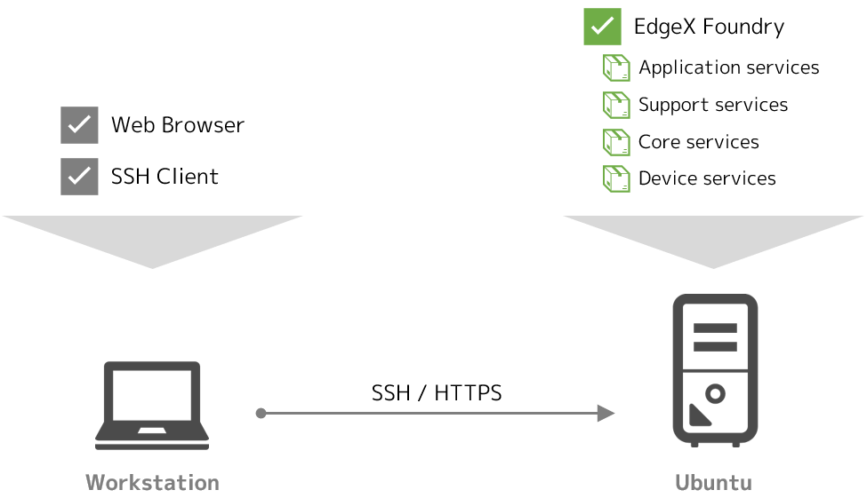


### 必要なファイルの用意

ラボに必要なファイルは、GitHub 上に用意しています。Ubuntu 上でクローンし、CPU のアーキテクチャに応じてディレクトリを移動してください。

=== "amd64"
    ```bash
    git clone https://github.com/kurokobo/edgex-hol-fuji.git
    cd edgex-hol-fuji
    cd amd64
    ```
=== "arm64"
    ```bash
    git clone https://github.com/kurokobo/edgex-hol-fuji.git
    cd edgex-hol-fuji
    cd arm64
    ```

このラボでは、`lab-getting-started` ディレクトリの中身を利用します。

```bash
cd lab-getting-started
ls -l
```

ファイル `docker-compose.yml` が存在しているはずです。

!!! tip "CPU のアーキテクチャ"
    Ubuntu を Raspberry Pi で動作させている場合は、アーキテクチャは `arm64` に相当します。それ以外の場合は、通常は `amd64` です。


## EdgeX Foundry の起動

手軽に起動できるよう、Docker Compose 用の YAML ファイルが、[EdgeX Foundry の `developer-scripts` リポジトリ](https://github.com/edgexfoundry/developer-scripts/tree/master/releases/fuji/compose-files) で公開されています。

このラボで利用する `docker-compose.yml` は、このうち `docker-compose-fuji-no-secty.yml` をリネームしたものです。エディタで開いて内容を確認するのもよいでしょう。

!!! note "no-secty とは"
    EdgeX Foundry には、機微情報を暗号化して保持するためのシークレットストアや、API ゲートウェイとして機能するプロキシなど、セキュリティ関係のマイクロサービスが存在しています。本番環境では重要な機能ですが、構成が複雑になるため、今回はこれらのセキュリティ関係のマイクロサービスを含まない状態で起動できる YAML ファイル `*-no-secty.yml` を利用しています。

まずは、利用されているイメージを Docker Hub からプルします。

```bash hl_lines="1"
$ docker-compose pull
Pulling volume            ... done
Pulling consul            ... done
Pulling config-seed       ... done
Pulling mongo             ... done
Pulling logging           ... done
Pulling system            ... done
Pulling notifications     ... done
Pulling metadata          ... done
Pulling data              ... done
Pulling command           ... done
Pulling scheduler         ... done
Pulling app-service-rules ... done
Pulling rulesengine       ... done
Pulling device-virtual    ... done
Pulling ui                ... done
Pulling portainer         ... done
```

プルできたら、デタッチモードで起動させます。

```bash hl_lines="1"
$ docker-compose up -d
Creating network "lab-getting-started_edgex-network" with driver "bridge"
Creating network "lab-getting-started_default" with the default driver
Creating volume "lab-getting-started_db-data" with default driver
Creating volume "lab-getting-started_log-data" with default driver
Creating volume "lab-getting-started_consul-config" with default driver
Creating volume "lab-getting-started_consul-data" with default driver
Creating volume "lab-getting-started_portainer_data" with default driver
Creating edgex-files ... done
Creating edgex-core-consul               ... done
Creating lab-getting-started_portainer_1 ... done
Creating edgex-mongo                     ... done
Creating edgex-config-seed               ... done
Creating edgex-support-logging           ... done
Creating edgex-core-data                 ... done
Creating edgex-support-notifications     ... done
Creating edgex-sys-mgmt-agent            ... done
Creating edgex-core-metadata             ... done
Creating edgex-core-command                   ... done
Creating edgex-support-scheduler              ... done
Creating edgex-app-service-configurable-rules ... done
Creating edgex-device-virtual                 ... done
Creating edgex-ui-go                          ... done
Creating edgex-support-rulesengine            ... done
```

すべてが `done` で完了したら、起動状態を確認します。

```bash hl_lines="1"
$ docker-compose ps
                Name                              Command               State                                                           Ports
-----------------------------------------------------------------------------------------------------------------------------------------------------------------------------------------------------
edgex-app-service-configurable-rules   /app-service-configurable  ...   Up       48095/tcp, 0.0.0.0:48100->48100/tcp
edgex-config-seed                      /edgex/cmd/config-seed/con ...   Exit 0
edgex-core-command                     /core-command --registry - ...   Up       0.0.0.0:48082->48082/tcp
edgex-core-consul                      docker-entrypoint.sh agent ...   Up       8300/tcp, 8301/tcp, 8301/udp, 8302/tcp, 8302/udp, 0.0.0.0:8400->8400/tcp, 0.0.0.0:8500->8500/tcp, 8600/tcp, 8600/udp
edgex-core-data                        /core-data --registry --pr ...   Up       0.0.0.0:48080->48080/tcp, 0.0.0.0:5563->5563/tcp
edgex-core-metadata                    /core-metadata --registry  ...   Up       0.0.0.0:48081->48081/tcp, 48082/tcp
edgex-device-virtual                   /device-virtual --profile= ...   Up       0.0.0.0:49990->49990/tcp
edgex-files                            /bin/sh -c /usr/bin/tail - ...   Up
edgex-mongo                            /edgex-mongo/bin/edgex-mon ...   Up       0.0.0.0:27017->27017/tcp
edgex-support-logging                  /support-logging --registr ...   Up       0.0.0.0:48061->48061/tcp
edgex-support-notifications            /support-notifications --r ...   Up       0.0.0.0:48060->48060/tcp
edgex-support-rulesengine              /bin/sh -c java -jar -Djav ...   Up       0.0.0.0:48075->48075/tcp
edgex-support-scheduler                /support-scheduler --regis ...   Up       0.0.0.0:48085->48085/tcp
edgex-sys-mgmt-agent                   /sys-mgmt-agent --registry ...   Up       0.0.0.0:48090->48090/tcp
edgex-ui-go                            ./edgex-ui-server                Up       0.0.0.0:4000->4000/tcp
lab-getting-started_portainer_1        /portainer -H unix:///var/ ...   Up       0.0.0.0:9000->9000/tcp
```

正常に起動できていれば、`edgex-config-seed` が `Exit 0` で終了している以外は、すべての `State` は `Up` に遷移します。

!!! tip "起動できない場合"
    停止してしまったコンテナのログを `docker logs <コンテナ名>` などで確認し、原因を特定します。`docker-compose down --volumes` で停止・削除し、原因を取り除いてから再試行します。ログに `exec format error` が出力されている場合は、CPU のアーキテクチャが異なる場合があります。


## 構成の確認

起動処理は、大まかには以下の順序で行われています。この起動順序は、`docker-compose.yml` 中で各サービスに `depends_on` を指定することで制御されています。

1. 各サービス用の永続ボリュームが用意され、`edgex-files` が起動して必要な初期データを配置する
1. 各サービスの構成情報を提供するレジストリである Consul（`edgex-core-consul`）を起動する
1. 各サービスの軌道に必要な構成情報をレジストリ（Consul）に登録する `edgex-config-seed` を起動する（登録が終わったら終了するため、`Exit 0` に遷移する）
1. 残りの各サービスが、自身の構成情報を Consul から取得したうえで、依存関係のある順番通りに起動する


### 起動しているサービス

今回の `docker-compose.yml` で定義されているマイクロサービスを、レイヤを踏まえて整理します。簡単にマッピングすると下図の通りです。

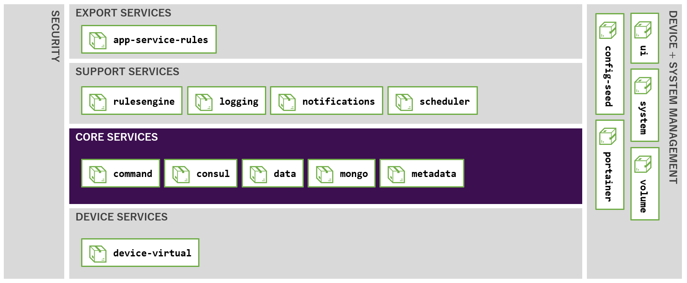

| サービス名 | コンテナ名 | 役割 |
|-|-|-|
| `app-service-rules` | `edgex-app-service-configurable-rules` | エクスポートサービス（アプリケーションサービス）のひとつです。ルールエンジンにデータを配送します。 |
| `rulesengine` | `edgex-support-rulesengine` | サポートサービスのひとつです。ルールエンジンです。 |
| `logging` | `edgex-support-logging` | サポートサービスのひとつです。各サービスからログを受け取ります。 |
| `notifications` | `edgex-support-notifications` | サポートサービスのひとつです。アラートや通知を制御します。 |
| `scheduler` | `edgex-support-scheduler` | サポートサービスのひとつです。データのクリーニングなどを制御します。 |
| `command` | `edgex-core-command` | コアサービスのひとつです。デバイスへのコマンド発行を制御します。 |
| `consul` | `edgex-core-consul` | コアサービスのひとつです。各サービスの構成情報を保持・提供するレジストリです。 |
| `data` | `edgex-core-data` | コアサービスのひとつです。データの収集と永続化を行います。 |
| `mongo` | `edgex-mongo` | コアサービスのひとつです。永続化されたデータの配置場所です。 |
| `metadata` | `edgex-core-metadata` | コアサービスのひとつです。EdgeX Foundry 配下のデバイスなどのオブジェクト群のメタデータを管理します。 |
| `device-virtual` | `edgex-device-virtual` | デバイスサービスのひとつです。仮想デバイスとそれ用のデバイスサービスです。 |
| `ui` | `edgex-ui-go` | Web GUI を提供します。 |
| `config-seed` | `edgex-config-seed` | EdgeX Foundry の起動時に、他のサービスの起動に必要な初期データをレジストリ（Consul）に登録します。 |
| `volume` | `edgex-files` | 永続ボリュームに初期データを配置します。 |
| `system` | `edgex-sys-mgmt-agent` | EdgeX Foundry 自体を管理する API を提供します。 |
| `portainer` | `portainer` | Docker 環境自体の管理ツールです。 |

!!! note "必要なサービスのいろいろ"
    今回は、Docker Compose を利用して起動させているため、`volume` や `portainer` など Docker 環境ならではのサービスも起動していますが、Docker を利用しない場合など、構成次第では、必要なサービスや起動順序は変化します。


### デバイスの取り扱い

このラボでは、EdgeX Foundry の最も基本的なユースケースとなる、

* **デバイスからのデータ収集**
* **デバイスの制御**

に注目して、特に、コアサービスのうち **データサービス** と **コマンドサービス**、デバイスサービスのうち **仮想デバイスサービス** を取り上げます。これ以外のサービスについても、後続のラボで取り上げていきます。

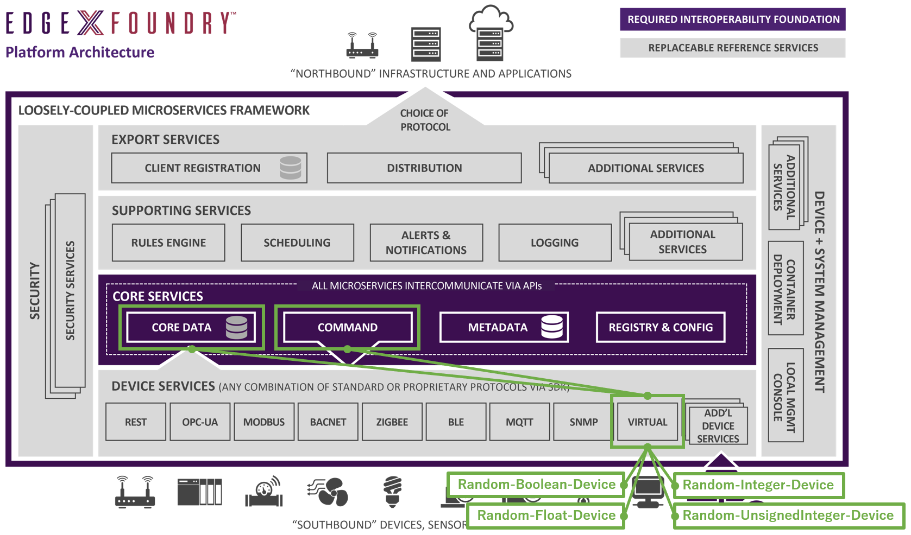

本来の使い方では、EdgeX Foundry でデータを収集したい、あるいは EdgeX Foundry から制御したい何らかの物理的なデバイスが存在しているはずですが、このラボでは存在しません。その代わりこのラボでは、テスト用に標準で用意されている **仮想デバイス** を利用します。

詳細は後続のラボで取り上げますが、この段階では、

* EdgeX Foundry で **何らかのデバイスを扱うには**
* そのデバイスを取り扱うための **デバイスサービスが必要である**

ことをおさえてください。つまり、このラボでは、**仮想デバイスそのもの** と、**仮想デバイスを取り扱うデバイスサービス** の二つの概念が登場します。

!!! note "仮想デバイスの実装"
    仮想デバイスに限っては、ひとつのサービス `device-virtual` の中に、デバイスそのものとそれ用のデバイスサービスの両方の実装が内包されています。

仮想デバイスを用いた今回のラボでは、大まかには次のような構成になっています。

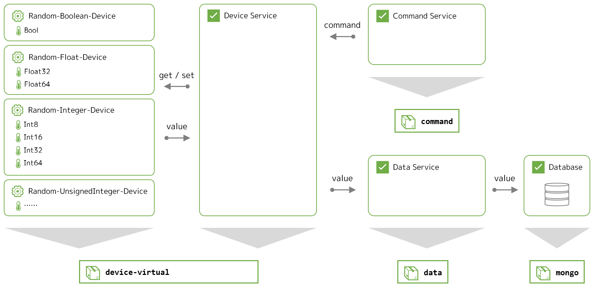

* **デバイス**
    * ランダムな値を生成し続けるだけの **デバイス** です
    * ひとつのデバイスが複数の **リソース** を持っています
        * リソースとは、物理的なデバイスでは、センサやアクチュエータひとつひとつに相当するもので、データ収集や制御の実行単位です
    * 指定したリソースの現在のランダム値を、外部から読み取れます
    * 指定したリソースの数値や生成ロジックを、外部から指定できます
* **デバイスサービス**
    * 4 つの仮想デバイスを管理するためのインタフェイスとして機能します
    * 事前に定義された間隔で、デバイスごと・リソースごとにその現在の値をデバイスから取得して、コアサービス（`data`）に送ります
    * コアサービス（`commnad`）からコマンドの実行命令を受け取って、指定されたデバイスの指定されたリソースに対して、実際の操作（現在値の取得、または値の設定など）を行います
* **コアサービス**
    * デバイスサービスから送られた値を蓄積します（`data`）
    * デバイスに対する操作の実行をデバイスサービスに指示します（`command`）

実際のユースケースでは、EdgeX Foundry で制御したい物理的なデバイスは、そのデバイスごと・リソースごとにさまざまなプロトコルや手順で情報を取得したり制御したりする必要があります。デバイスサービスは、そうしたデバイスごとのお作法の差異を抽象化することで、異なるデバイスに対しても統一された操作体系と管理手段を提供するインタフェイスとして機能しています。


## 操作手段

管理者が EdgeX Foundry に対して操作を行いたい場合は、Web GUI か REST API、CLI を利用します。ただし、GUI も CLI も現時点では **実行できる機能は限定的** であり、細かな制御には **後述の API の利用が必須** となる点には注意が必要です。

!!! tip "手動での操作の必要性"
    値の確認だけでなく、各種設定の変更や新規デバイスの追加なども、API を利用して実行できます。とはいえ、起動後に何らかの構成変更を加えるよりは、理想的には、起動するだけで必要な構成がすべてできあがった状態になるように、設定ファイルをすべて事前に用意し、`docker-compose.yml` でそれをマウントする定義をあらかじめ入れておくなどの工夫をすべきです。そうすれば、すべての構成をテキストベースでリポジトリで管理できるようになり、いわゆる IaC の実現にもつなげられます。


### GUI での操作

`ui` サービス（`edgex-ui-go` コンテナ）が、標準の Web GUI です。

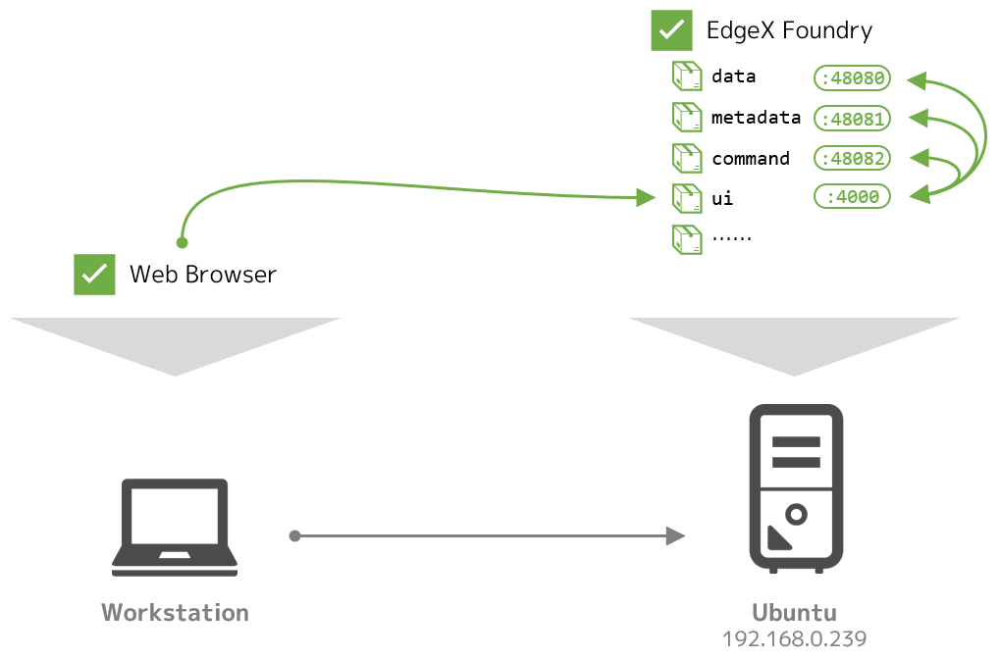

Docker ホストの IP アドレスを確認して、`http://<IP アドレス>:4000/` にブラウザでアクセスし、デフォルトのユーザ `admin`（パスワードも `admin`）でログインできます。

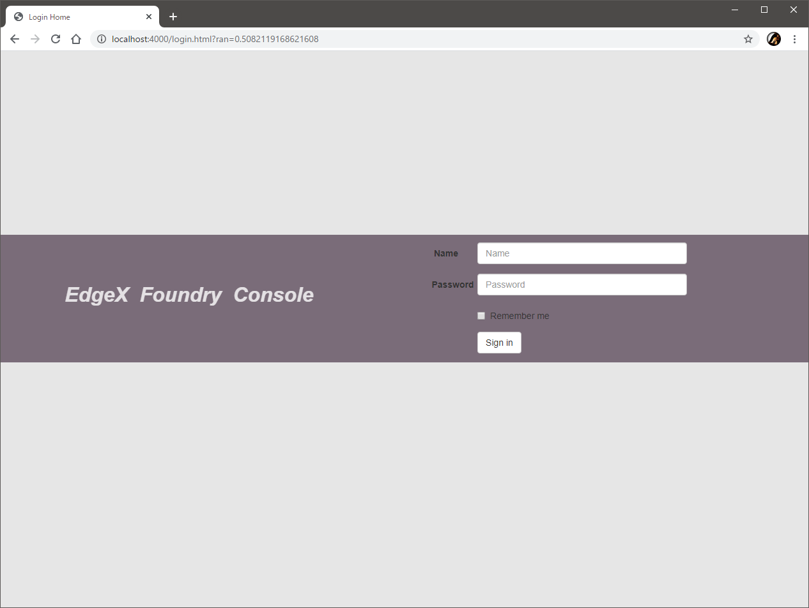

この GUI を利用するには、まずはこの GUI で操作する対象を登録する必要があります。左ペインの [`Gateway`] に遷移し、右ペインの [`Add`] ボタンで、[`Address`] に Docker ホストの IP アドレスを登録します。[`Name`] と [`Description`] は任意の文字列を入力しです。

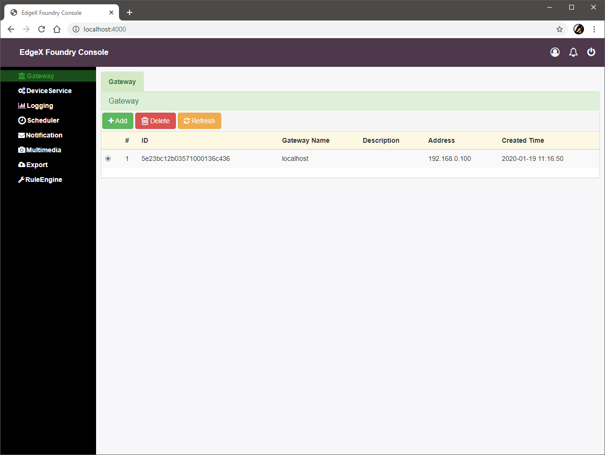

!!! tip "ゲートウェイ"
    GUI を操作すると、`edgex-ui-go` が各マイクロサービスへの REST API の実行を肩代わりしてくれます。ここでの **ゲートウェイ** は、この API のリクエスト先の IP アドレスです。よって、もしマイクロサービスが複数のノードに分散配置されている場合は、操作ごとにリクエスト先の IP アドレスを変更する必要がありますが、現在の実装では困難です。このため、セキュリティサービス（この本ガイドでは取り扱いません）に含まれるプロキシを API ゲートウェイとして利用する構成を検討します。

登録したゲートウェイを選択した状態で左ペインから [`Device Service`] に遷移すると、仮想デバイスを制御しているデバイスサービスである `device-virtual` が登録されている様子が見えるはずです。


さらにデバイスサービス `device-virtual` の [`Devices`] アイコンを展開すると、このデバイスサービスで管理している配下のデバイス（仮想デバイス）が確認できます。

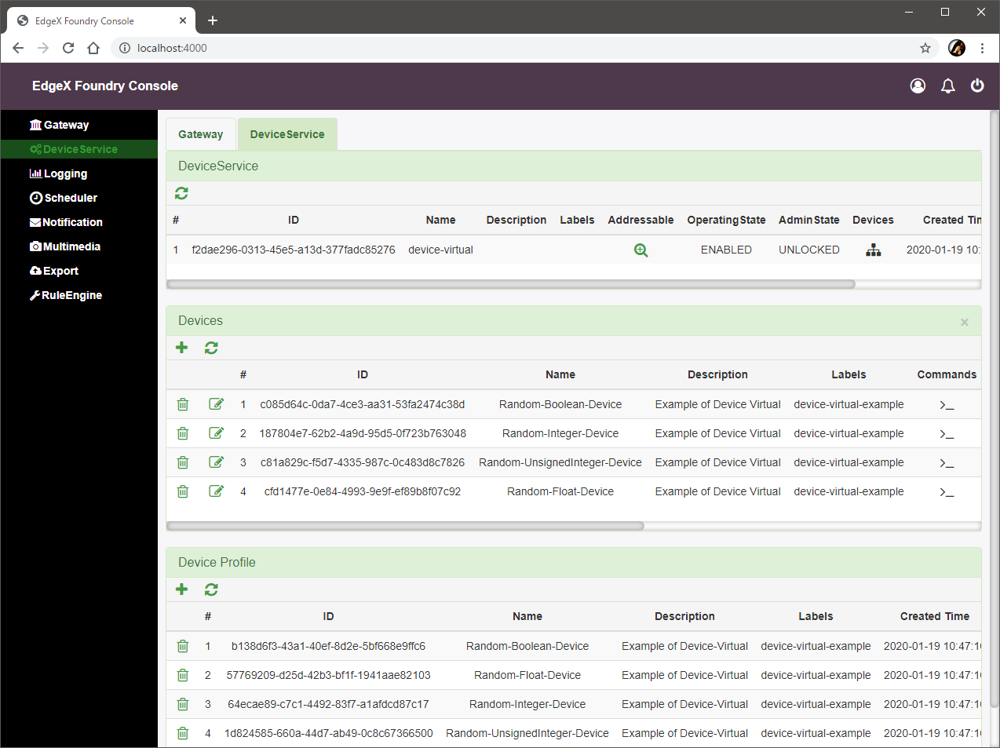

さらにデバイスごとの [`Commands`] を展開すると、デバイスごとの各リソースからの情報の取得（`get`）や、制御命令の実行（`set`）ができるようになっています。

!!! note "別の GUI"
    別の GUI が欲しい場合、[`edgex-ui-closure`](https://github.com/edgexfoundry/edgex-ui-clojure) という、Edge Xpert（EdgeX Foundry の商用版）の GUI のベースになったものも存在しています。見た目もきれいで最低限の動作もしますが、開発はあまり活発ではないようです。簡単な構成方法は、[こちらのブログエントリ（日本語）](https://blog.kurokobo.com/archives/2665) でも紹介しています（情報が古い可能性があります）。


### API での操作

各マイクロサービスは REST API のエンドポイントを持っています。cURL や Postman などのツールを用いて、`GET` や `POST` のリクエストを発行することで、様々な操作を行えます。[公式のリファレンス](https://fuji-docs.edgexfoundry.org/Ch-APIReference.html) のほか、使い方の例は [API のウォークスルー](https://fuji-docs.edgexfoundry.org/Ch-Walkthrough.html) も参考にできます。

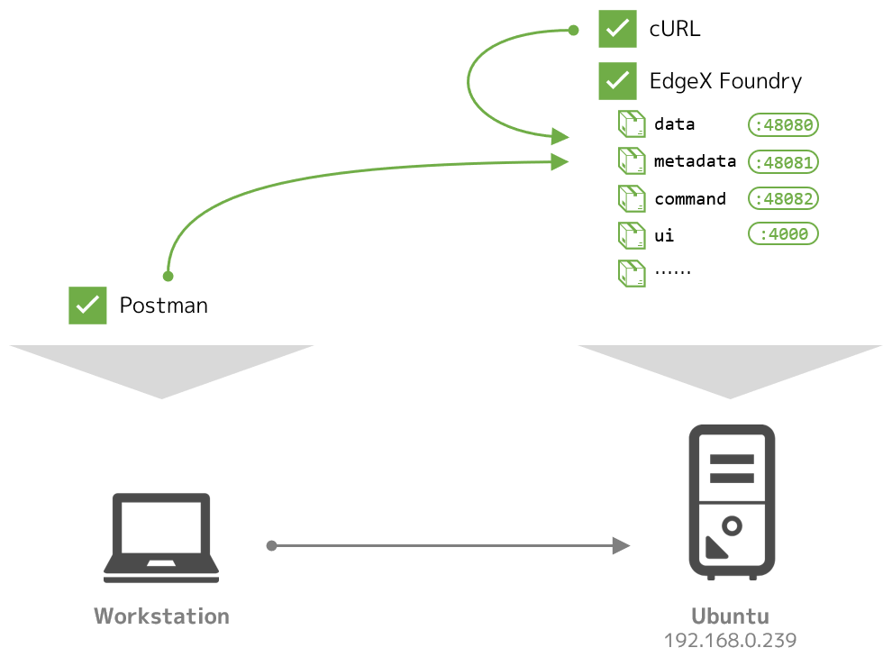

例えば、存在しているデバイスサービスや、そこで管理されているデバイス群を確認したい場合は、以下のエンドポイントに `GET` リクエストを投げると JSON で返ってきます。

* デバイスサービスの一覧
    * `http://<IP アドレス>:48081/api/v1/deviceservice`
* 各デバイスサービスの詳細
    * `http://<IP アドレス>:48081/api/v1/deviceservice/name/<デバイスサービス名>`
    * `http://<IP アドレス>:48081/api/v1/deviceservice/<デバイスサービス ID>`
* デバイスの一覧
    * `http://<IP アドレス>:48081/api/v1/device`
* 各デバイスの詳細
    * `http://<IP アドレス>:48081/api/v1/device/name/<デバイス名>`
    * `http://<IP アドレス>:48081/api/v1/device/<デバイス ID>`

!!! ポート番号
    このラボのように EdgeX Foundry を Docker Compose で起動している場合は、外部からはすべてのマイクロサービスの API エンドポイントが同じ IP アドレスでホストされているように見えます。ただし、IP アドレスが同じでも、各マイクロサービスのコンテナはそれぞれが異なるポート番号で待ち受けているので、目的の操作に応じて適切なポート番号を確認する必要があります。例えば、上記の `48081` 番ポートは、`metadata` サービスの待ち受けポートです。


### CLI での操作

CLI として、現時点ではまだ GA していませんが、[`edgex-cli` というプロジェクト](https://github.com/edgexfoundry-holding/edgex-cli) で開発が進められています。

開発途中であり仕様が大きく変更される可能性があることから、本ガイドでは取り扱いませんが、[リポジトリの `README.md`](https://github.com/edgexfoundry-holding/edgex-cli/blob/master/README.md) の導入手順に従うと利用できます。[こちらのブログエントリ（日本語）](https://blog.kurokobo.com/archives/2665) では、コンテナを利用して動作させる方法を紹介しています（情報が古い可能性があります）。


## 蓄積データの確認

今回利用しているデバイスサービスは、事前に構成された設定に従って、起動すると自動的に動作を開始します。つまり、仮想デバイスではランダムな数値が生成され、その値はデバイスサービス `virtual-device` を通じてコアサービスにすでに蓄積されています。

ここでは、実際に蓄積された値を確認します。


### 蓄積データの構造

EdgeX Foundry では、デバイスから取得したひとつのデータは `Reading` オブジェクトとして取り扱われ、デバイスサービスが一回の処理で取得した `Reading` の集合が、コアサービスに `Event` オブジェクトとして送信され、蓄積されていきます。

* **`Reading`**
    * 単一のデバイスの単一のリソースから取得したひとつの値と、その取得時間などのメタ情報を含むオブジェクト
* **`Event`**
    * あるデバイスサービスが、一回の処理で取得した一つ以上の `Reading` の集合
    * デバイスサービスがコアサービスにデータを送る（`data` サービスの API に`POST` する）単位

例えば、あるデバイスで **温度と湿度をセットで `get` できる** ように構成した場合は、ひとつの `Event` に二つの `Reading` が含まれることになります。

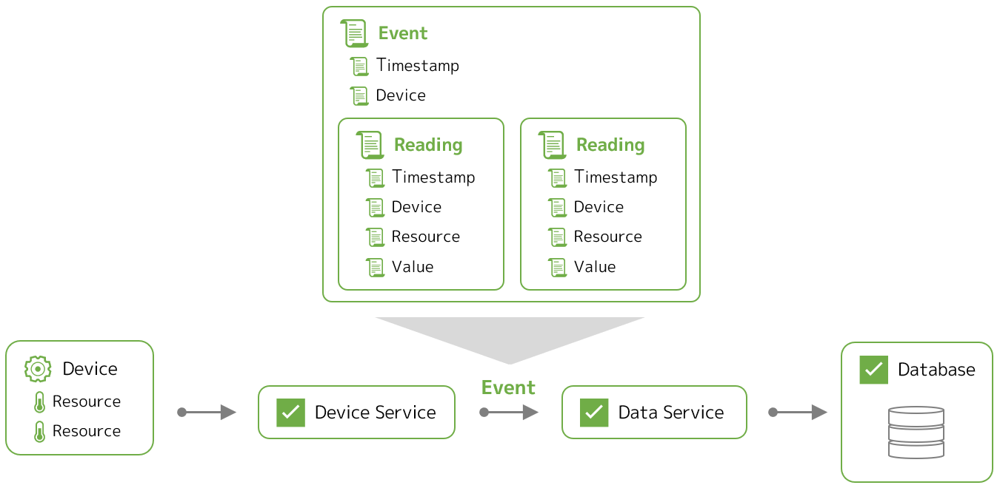


### 蓄積データの確認

`Event` を取得する `data` サービスのエンドポイントに `GET` すると、`Reading` を含む `Event` 情報が得られます。今回の仮想デバイスでは、ひとつの `Event` にはひとつの `Reading` が含まれます。

ここでは、Docker ホスト上で `curl` コマンドを用いて、

* デバイス `Random-Float-Device` の
* 直近の `Event` を `2` つ

を確認します。URL にこの情報を含めて `GET` します。

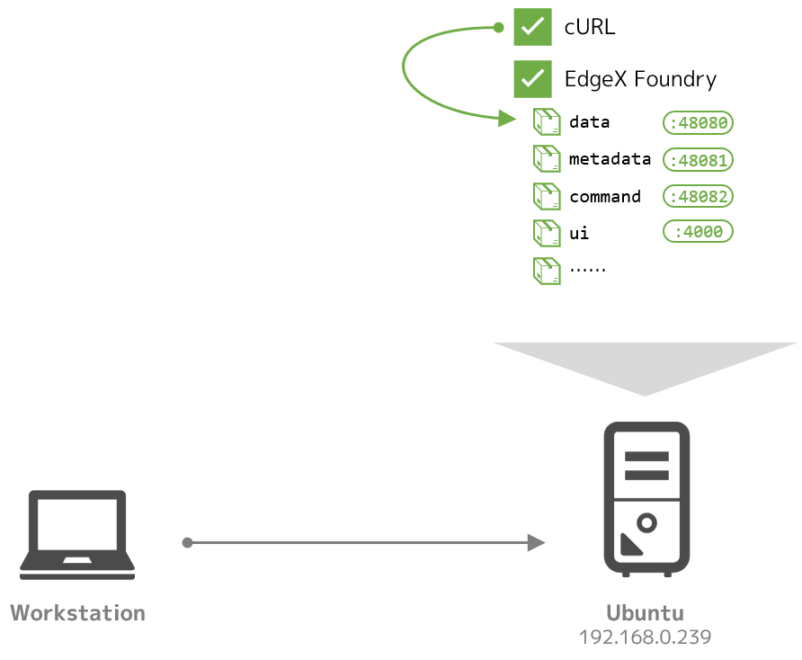

```bash hl_lines="1"
$ curl -s http://localhost:48080/api/v1/event/device/Random-Float-Device/2 | jq
[
  {
    "id": "4949fc7f-069b-49b1-bc52-f905c5109692",
    "device": "Random-Float-Device",
    "created": 1579419158139,
    "modified": 1579419158139,
    "origin": 1579419158137800200,
    "readings": [
      {
        "id": "6dcac272-28ad-4755-972f-ad58b02aa000",
        "created": 1579419158138,
        "origin": 1579419158124917000,
        "modified": 1579419158138,
        "device": "Random-Float-Device",
        "name": "Float32",
        "value": "fvU+Nw=="
      }
    ]
  },
  {
    "id": "f4f62305-ce8c-4f19-960b-ba2977ab0b2b",
    "device": "Random-Float-Device",
    "created": 1579419157643,
    "modified": 1579419157643,
    "origin": 1579419157642273800,
    "readings": [
      {
        "id": "227aa868-6dbe-4e53-af27-c773075eac85",
        "created": 1579419157642,
        "origin": 1579419157630999000,
        "modified": 1579419157642,
        "device": "Random-Float-Device",
        "name": "Float64",
        "value": "1.258607e+308"
      }
    ]
  }
]
```

`Event` オブジェクトが二つ返り、それぞれに `Reading` オブジェクトが含まれていることが読み取れます。

!!! note "二種類のリソース"
    デバイス `Random-Float-Device` には二つのリソース `Float32` と `Float64` が存在しており、デバイスサービス内ではこの二つからの値の取得はほぼ同時にトリガされます。このため、直近の二つを指定した今回の操作の結果には、この両方の値が含まれています。

!!! tip "`jq` コマンド"
    JSON を扱うコマンドです。多くのディストリビューションでパッケージマネージャ（Ubuntu であれば `apt install jq` ）を用いてで導入できます。Windows 用のバイナリも用意されています。詳細は [公式サイト](https://stedolan.github.io/jq/) を参照してください。ここでは、REST API のレスポンスを整形して表示するために利用しています。

特定のリソースで読み取った情報だけを得たい場合は、`Reading` を操作するエンドポイントにリソース名を指定して `GET` します。例えば、

* リソース `Float64` の
* 直近の `Reading` を `2` つ

であれば、次の通りです。

```bash hl_lines="1"
$ curl -s http://localhost:48080/api/v1/reading/name/Float64/2 | jq
[
  {
    "id": "e1e950c0-7533-4664-a606-91c97e8dbb85",
    "created": 1579419397777,
    "origin": 1579419397752820200,
    "modified": 1579419397777,
    "device": "Random-Float-Device",
    "name": "Float64",
    "value": "8.073392e+305"
  },
  {
    "id": "2b30bdf3-cb3e-4bac-bd20-87653e9259f2",
    "created": 1579419367748,
    "origin": 1579419367735956200,
    "modified": 1579419367748,
    "device": "Random-Float-Device",
    "name": "Float64",
    "value": "-3.105079e+307"
  }
]
```


!!! tip "エンコードされた数値のデコード"
    データを確認した際、`Float32` の値が `/oyN8A==` のように文字列で表示されていました。これは、内部ではこの型の数値（を表すバイト列）を Base64 でエンコードして保持しているためです。

    数値を保持する際のエンコード有無は、デバイスを追加するときに作成するデバイスプロファイル（後続のラボで取り扱います）の中で指定できますが、今回は仮想デバイスをデフォルトの設定のまま利用しているため、デフォルトの設定に従ってこのようになっています。

    簡単な紹介のみにとどめますが、エンコードされた数値はデコードすると数値に戻せます。[非常に簡単なデコーダを公開している](https://github.com/kurokobo/edgex-decode-base64) ので、Go 言語が動く環境があれば利用できます。

    ```bash hl_lines="1 2 3"
    $ git clone https://github.com/kurokobo/edgex-decode-base64.git
    $ cd edgex-decode-base64/
    $ go run main.go /eOKAw==
    8.163255e-37
    ```


### データベースの確認

確認した `Event` や `Reading` などのデータは、インタフェイスこそ `data` サービスの API でしたが、実際には MongoDB に保管されています。通常は行わない操作ですが、MongoDB に直接アクセスすることでも、実際のデータを確認できます。

!!! tip "Geneva リリースでのデータベース"
    Geneva リリースからは、標準のデータベースが MongoDB から Redis に変更されます。

外部から MongoDB Compass などでアクセスする場合は、Docker ホストのポート `27017` にユーザ名 `core`、パスワード `password` で認証できますが、ここではコンテナのシェルに入って確認します。

今回の構成では、`edgex-mongo` がMongoDB の実体のコンテナです。Docker ホストからこれのシェルを取って、MongoDB のプロンプトに入ります。複数のデータベースが存在していることがわかります。

```hl_lines="1 3 7"
$ docker exec -it edgex-mongo bash
 
# mongo
MongoDB shell version v4.2.0
...
 
> show databases
admin                0.000GB
application-service  0.000GB
config               0.000GB
coredata             0.011GB
exportclient         0.000GB
local                0.000GB
logging              0.006GB
metadata             0.000GB
notifications        0.000GB
scheduler            0.000GB
```

`Event` と `Reading` の値は、`coredata` 内のコレクションに保持されています。

```hl_lines="1 4"
> use coredata
switched to db coredata
 
> show collections
event
reading
valueDescriptor
```

あとは MongoDB として操作すればよく、例えば `find()` などを叩けばデータを参照できます。終了するには `exit` します。

```hl_lines="1 8 9"
> db.reading.find().limit(5)
{ "_id" : ObjectId("5e2471bb0e360800014be635"), "created" : NumberLong("1579446715833"), "modified" : NumberLong("1579446715833"), "origin" : NumberLong("1579446715806322700"), "uuid" : "e0af3c99-be57-4cec-a59a-2af2da976d41", "pushed" : NumberLong(0), "device" : "Random-Boolean-Device", "name" : "Bool", "value" : "true" }
{ "_id" : ObjectId("5e2471bb0e360800014be637"), "created" : NumberLong("1579446715857"), "modified" : NumberLong("1579446715857"), "origin" : NumberLong("1579446715831613700"), "uuid" : "c336b11e-8e91-4007-bd3f-1ee63d80e45b", "pushed" : NumberLong(0), "device" : "Random-Boolean-Device", "name" : "Bool", "value" : "false" }
{ "_id" : ObjectId("5e2471c00e360800014be639"), "created" : NumberLong("1579446720829"), "modified" : NumberLong("1579446720829"), "origin" : NumberLong("1579446720815333700"), "uuid" : "2ae4befc-1fee-48ab-b621-b4d56747a446", "pushed" : NumberLong(0), "device" : "Random-Integer-Device", "name" : "Int16", "value" : "9761" }
{ "_id" : ObjectId("5e2471c00e360800014be63b"), "created" : NumberLong("1579446720843"), "modified" : NumberLong("1579446720843"), "origin" : NumberLong("1579446720830168500"), "uuid" : "317ea1f1-0c36-4e6d-a489-b48711ff5dd6", "pushed" : NumberLong(0), "device" : "Random-Integer-Device", "name" : "Int64", "value" : "-9069744988884413669" }
{ "_id" : ObjectId("5e2471c00e360800014be63d"), "created" : NumberLong("1579446720857"), "modified" : NumberLong("1579446720857"), "origin" : NumberLong("1579446720841898700"), "uuid" : "5be3634e-b171-4849-9bac-f13de720c11e", "pushed" : NumberLong(0), "device" : "Random-Integer-Device", "name" : "Int32", "value" : "-913901160" }
 
> exit
# exit
```


## 環境の停止

後続のラボでは、現在利用しているものとは別の `docker-compose.yml` ファイルを利用しますので、今回のこの環境はクリーンアップします。

次のコマンドで、作成したコンテナと、自動で作成された永続ボリューム領域を削除します。

```bash hl_lines="1"
$ docker-compose down --volumes
Stopping edgex-ui-go                          ... done
...
Removing image portainer/portainer
```

!!! note イメージは削除しない
    プルしたイメージは後続のラボでまた利用しますので、`--rmi all` は指定しません。


## まとめ

このラボでは、以下を取り扱いました。

* Docker Compose を利用した EdgeX Foundry の起動と停止を実践しました
* EdgeX Foundry の大まかな構成を確認し、デバイスとデバイスサービスの考え方の概要を確認しました
* GUI と API の操作を実践しました
* 蓄積されたデータの閲覧方法を確認しました
