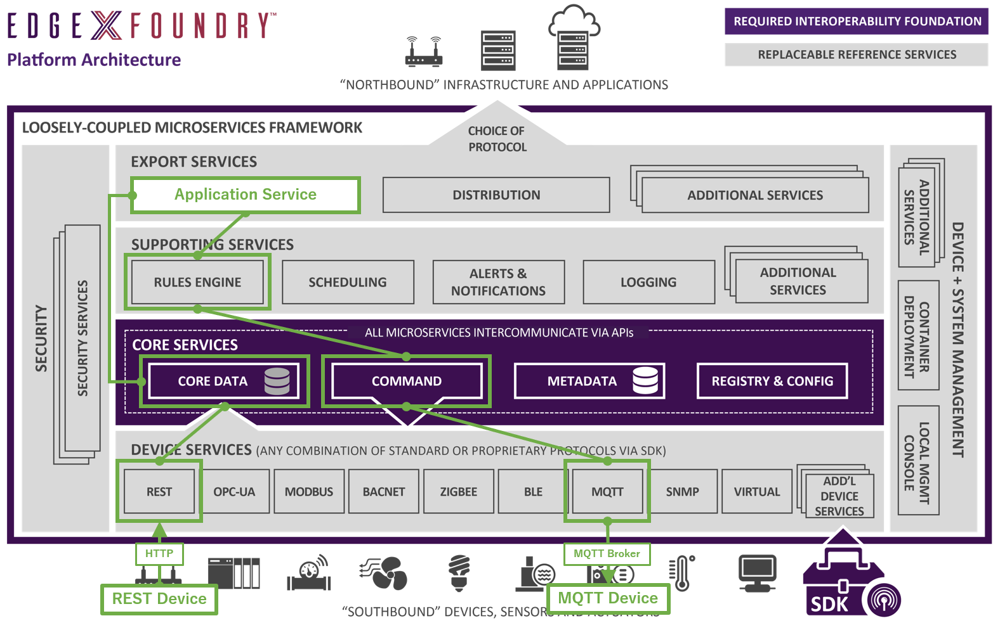
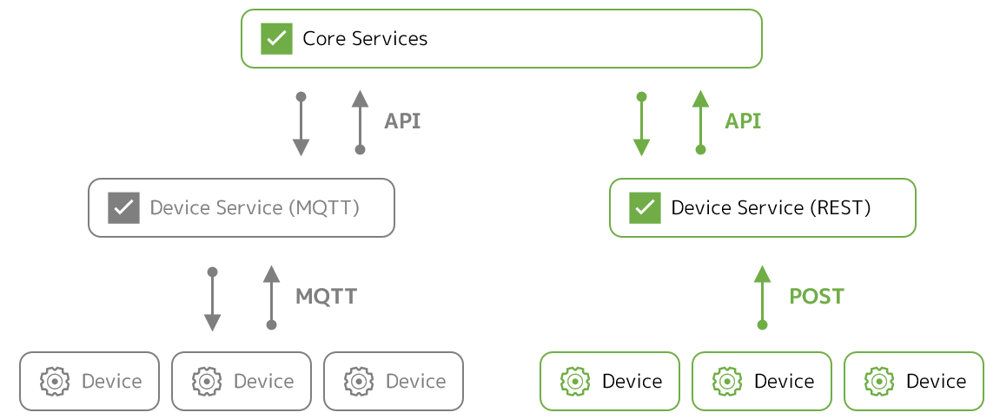
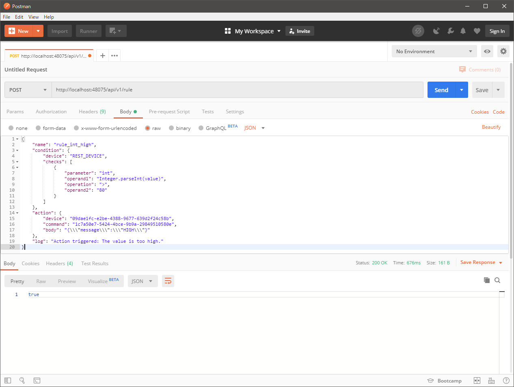
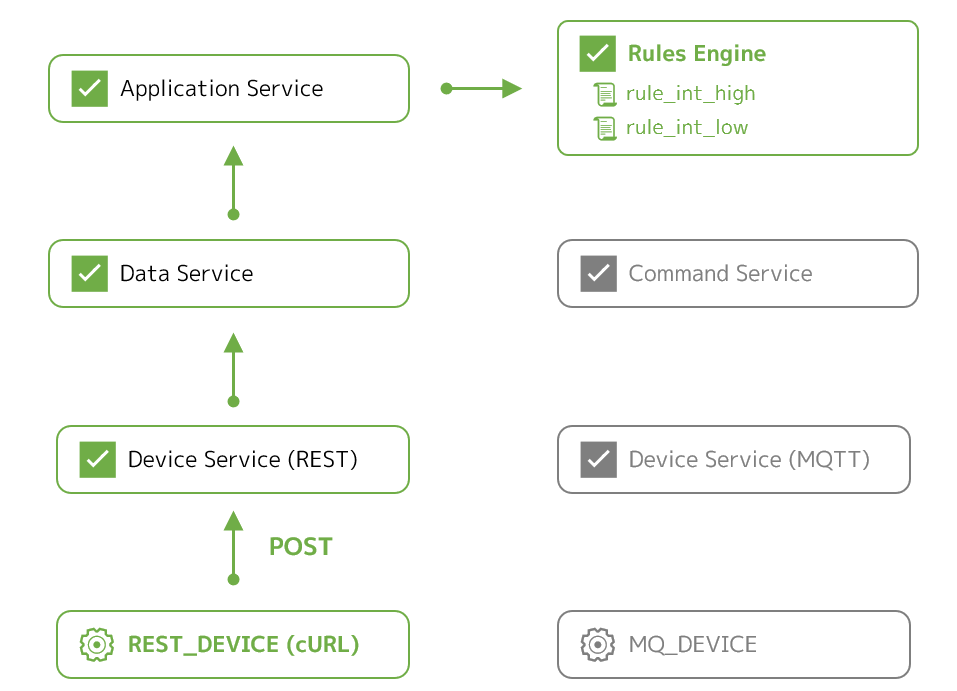
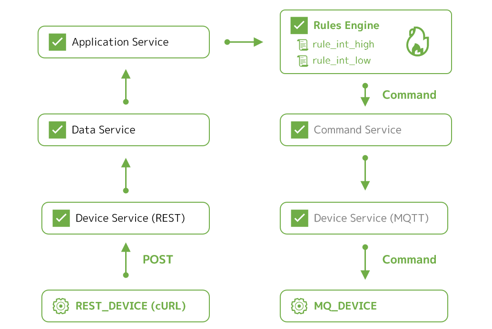

# Lab 5 - Using Rules Engine

このラボでは、EdgeX Foundry のルールエンジンを構成して、あるデバイスの状態の変化をトリガにして別のデバイスを自動で操作させる手法を実践します。

!!! note "ルールエンジンの将来性"
    Fuji リリース標準のルールエンジン `support-rulesengine` の実装は [**Drools**](https://www.drools.org/) ですが、Geneva リリース以降は [**EMQ X Kuiper**](https://github.com/emqx/kuiper) に置き換わっていく予定のようです。両者の実装と利用方法は大きく異なるため、このラボの内容は Kuiper には適用できません。


## このラボのゴールと構成

このラボの目的は次の通りです。

* ルールエンジンの概要と考え方を理解する
* 任意のルールの構成方法を理解する

このラボでは、Docker Compose を利用して、Ubuntu 上の Docker コンテナ群として EdgeX Foundry を起動させます。また、自動制御対象とするデバイスのシミュレータと、それが利用する MQTT のブローカも Docker コンテナとして起動させます。


これまでのラボでは、仮想デバイスや MQTT デバイスを用いて、デバイスからの情報の収集やデバイスへのコマンドの実行を試してきました。今回は、それらを応用して、ルールエンジンを利用して、

* 何らかのデバイスのリソースの値が
* 何らかの条件を満たしたら
* 別のデバイスでコマンドを実行する

ような自動制御を実際に試します。

もちろん、あるデバイスをトリガにそのデバイス自身を自動操作させること可能ですが、別のデバイスを操作できるほうが理解しやすいので、このラボでは新しいデバイスサービスをひとつ追加して組み込みます。具体的には、

* **ルール 1**
    * **REST デバイス** から送られる値が
    * 80 を越えたら
    * **MQTT デバイス** にメッセージ `HIGH` を送信する
* **ルール 2**
    * **REST デバイス** から送られる値が
    * 20 を下回ったら
    * **MQTT デバイス** にメッセージ `LOW` を送信する

ようなルールの実装を目指します。図示すると以下のような状態です。




### 必要なファイルの用意

ラボに必要なファイルは、前のラボでクローンしたリポジトリに含まれています。クローンを実施していない場合は、Ubuntu 上でクローンし、CPU のアーキテクチャに応じてディレクトリを移動してください。

=== "amd64"
    ```bash
    git clone https://github.com/kurokobo/edgex-hol-fuji.git
    cd edgex-hol-fuji
    cd amd64
    ```
=== "arm64"
    ```bash
    git clone https://github.com/kurokobo/edgex-hol-fuji.git
    cd edgex-hol-fuji
    cd arm64
    ```

このラボでは、`lab-support-rulesengine` ディレクトリの中身を利用します。

```bash
cd lab-support-rulesengine
ls -l
```

ファイル `docker-compose.yml` のほか、2 つの JSON ファイルと、4 つのディレクトリ `device-service-mqtt`、`device-service-rest`、`simulator-mqtt`、`support-rulesengine` が存在しているはずです。


## REST デバイスの追加

MQTT を利用するデバイス用のデバイスサービス `device-mqtt-go` があったように、REST API を利用するデバイス用のデバイスサービス `device-rest-go` があります。これは、次のようなデバイスサービスです。

* 外部の REST API のエンドポイントに `POST` することで値を送るようなデバイスを対象として
* `POST` されたリクエストのボディを値として EdgeX Foundry に取り込む



このデバイスサービスを構成すると、デバイスサービス自身が `POST` リクエストを受け付けるエンドポイントを持つようになります。

デバイスがデバイスサービスの `/api/v1/resource/<デバイス名>/<リソース名>` に対して `POST` すれば、デバイスサービスは `POST` された値を URL で指定したデバイスの指定したリソースの値であるものとして取り込みます。デバイス名やリソース名は、他のデバイスと同様、デバイスプロファイルなどの設定ファイルで定義できます。

!!! tip "REST デバイスサービスの制約"
    REST デバイスサービスは、現時点の実装では、デバイス側から `POST` された値を取り込むのみで、他のデバイスサービスと異なり **デバイス側へのコマンド実行はできない** ようです。また、デバイス側から JSON 文字列を `POST` しても、デバイスサービス側ではパースやバリデーションは行われません。JSON 文字列として成立していない文字列を投げても取り込まれてしまうため、そのデータを利用する後続のアプリケーションサービスなどで別途バリデーションを検討する必要があります。


### 今回試す設計

今回は、[`device-rest-go` の `README.md`](https://github.com/edgexfoundry/device-rest-go) を参考に、以下のデバイスサービスとデバイスを定義しています。お手元の `device-service-rest` ディレクトリ内に配置しています。エディタで確認してもよいでしょう。

* **デバイスプロファイル**
    * `rest.test.device.profile.yml` ファイル
    * リソース `int` と `float` を定義
* **デバイスサービスコンフィグレーション**
    * `configuration.toml` ファイル
    * 上記のデバイスプロファイルに紐づけた `REST_DEVICE` を定義

これにより、

* `/api/v1/resource/REST_DEVICE/int`
* `/api/v1/resource/REST_DEVICE/float`

に値を POST すれば取り込んでもらえるようになるはずです。今回は、デバイスの実体は用意せず、人間がデバイスに成り代わる手順です。つまり、**デバイスに代わって人間がこのエンドポイントに手動で `POST` する** ことで値を取り込ませます。

この REST デバイスサービスを含め、今回分の環境は、`docker-compose.yml` に反映済みです


### 起動準備と起動

REST デバイスだけでなく MQTT デバイスも使うので、これも準備します。お手元の **`device-service-mqtt/configuration.toml` に IP アドレスが含まれるので、環境に合わせて修正** してください。なお、MQTT デバイスの構成は、[デバイスサービス（MQTT）のラボ](lab-device-service-mqtt.md) と同じです。

修正できたら、MQTT ブローカ、MQTT デバイスの順に起動します。**コマンドにも IP アドレスを含んでいるので、適宜修正** してください。


=== "amd64"
    ```bash hl_lines="1 4 8 10 15"
    $ docker run -d --rm --name broker -p 1883:1883 eclipse-mosquitto
    9e1c5939be6a9c6366c2cbdad5eae5ab5c1665062125d0a8971aa030d2116a8d

    $ docker ps
    CONTAINER ID        IMAGE               COMMAND                  CREATED             STATUS              PORTS                    NAMES
    9e1c5939be6a        eclipse-mosquitto   "/docker-entrypoint.…"   6 seconds ago       Up 3 seconds        0.0.0.0:1883->1883/tcp   broker

    $ cd simulator-mqtt

    $ docker run -d --restart=always --name=mqtt-scripts -v "$(pwd):/scripts" dersimn/mqtt-scripts --url mqtt://192.168.0.239 --dir /scripts
    Unable to find image 'dersimn/mqtt-scripts:latest' locally
    ...
    9d52b4956ebbec60dd0f93bdf9750ff915fefd8e8c58d3ce8bc7ba1429693d2b

    $ docker ps
    CONTAINER ID        IMAGE                        COMMAND                  CREATED             STATUS              PORTS                    NAMES
    13f70f88b67b        dersimn/mqtt-scripts         "node /node/index.js…"   18 seconds ago      Up 16 seconds                                mqtt-scripts
    9e1c5939be6a        eclipse-mosquitto            "/docker-entrypoint.…"   16 minutes ago      Up 16 minutes       0.0.0.0:1883->1883/tcp   broker
    ```
=== "arm64"
    ```bash hl_lines="1 4 8 10 15"
    $ docker run -d --rm --name broker -p 1883:1883 eclipse-mosquitto
    9e1c5939be6a9c6366c2cbdad5eae5ab5c1665062125d0a8971aa030d2116a8d

    $ docker ps
    CONTAINER ID        IMAGE               COMMAND                  CREATED             STATUS              PORTS                    NAMES
    9e1c5939be6a        eclipse-mosquitto   "/docker-entrypoint.…"   6 seconds ago       Up 3 seconds        0.0.0.0:1883->1883/tcp   broker

    $ cd simulator-mqtt

    $ docker run -d --restart=always --name=mqtt-scripts -v "$(pwd):/scripts" dersimn/mqtt-scripts:armhf --url mqtt://192.168.0.239 --dir /scripts
    Unable to find image 'dersimn/mqtt-scripts:armhf' locally
    ...
    9d52b4956ebbec60dd0f93bdf9750ff915fefd8e8c58d3ce8bc7ba1429693d2b

    $ docker ps
    CONTAINER ID        IMAGE                        COMMAND                  CREATED             STATUS              PORTS                    NAMES
    13f70f88b67b        dersimn/mqtt-scripts:armhf   "node /node/index.js…"   18 seconds ago      Up 16 seconds                                mqtt-scripts
    9e1c5939be6a        eclipse-mosquitto            "/docker-entrypoint.…"   16 minutes ago      Up 16 minutes       0.0.0.0:1883->1883/tcp   broker
    ```

最後に、EdgeX Foundry を起動します。`State` が `Up` になることを確認します。

```bash hl_lines="1 3 5"
$ cd ../

$ docker-compose up -d

$ docker-compose ps
```


### REST デバイスサービスの動作確認

起動が確認できたら、実際にエンドポイントに `POST` して、データの取り込みを確認します。REST デバイスサービスの待ち受けポートは `49986` に（`docker-compose.yml` で）設定しています。`Content-Type` は `text/plain` である必要があります。`-d` が `POST` する値の指定です。

```bash hl_lines="1"
$ curl -X POST -H "Content-Type: text/plain" -d 12345 http://localhost:49986/api/v1/resource/REST_DEVICE/int
```

`edgex-device-rest` コンテナのログで Pushed event to core data が記録されていれば、値は正常に受け付けられています。

```bash hl_lines="1"
$ docker logs --tail 5 edgex-device-rest
level=DEBUG ts=2020-01-25T07:49:17.0621062Z app=edgex-device-rest source=resthandler.go:82 msg="Received POST for Device=REST_DEVICE Resource=int"
level=DEBUG ts=2020-01-25T07:49:17.0673842Z app=edgex-device-rest source=resthandler.go:101 msg="Content Type is 'text/plain' & Media Type is 'text/plain' and Type is 'Int64'"
level=DEBUG ts=2020-01-25T07:49:17.0726606Z app=edgex-device-rest source=resthandler.go:142 msg="Incoming reading received: Device=REST_DEVICE Resource=int"
level=DEBUG ts=2020-01-25T07:49:17.0766349Z app=edgex-device-rest source=utils.go:75 correlation-id=946f482c-db1f-44b5-8a76-437c4ca3d3e9 msg="SendEvent: EventClient.MarshalEvent encoded event"
level=INFO ts=2020-01-25T07:49:17.0899243Z app=edgex-device-rest source=utils.go:93 Content-Type=application/json correlation-id=946f482c-db1f-44b5-8a76-437c4ca3d3e9 msg="SendEvent: Pushed event to core data"
```

`data` サービスを確認すると、実際に取り込まれていることがわかります。

```bash hl_lines="1"
$ curl -s http://localhost:48080/api/v1/event/device/REST_DEVICE/1 | jq
[
  {
    "id": "8361d739-f248-4149-9f39-be7a05589c93",
    "device": "REST_DEVICE",
    "created": 1579938557076,
    "modified": 1579938557076,
    "origin": 1579938557075902352,
    "readings": [
      {
        "id": "d624d638-2f32-4a9c-a0f0-6e7f2797a172",
        "created": 1579938557073,
        "origin": 1579938557072646900,
        "modified": 1579938557073,
        "device": "REST_DEVICE",
        "name": "int",
        "value": "12345"
      }
    ]
  }
]
```

MQTT デバイスの値も取り込めていることを確認します。

```bash hl_lines="1"
$ curl -s http://localhost:48080/api/v1/event/device/MQ_DEVICE/1 | jq
```


## ルールエンジンの利用

ここから、ルールエンジンを構成していきます。


### ルールエンジンの概要

詳細は [公式のドキュメント](https://fuji-docs.edgexfoundry.org/Ch-RulesEngine.html) がわかりやすいですが、端的に言えば、

* コアサービスまたはエクスポートサービスからデータを受け取る
* 事前に定義されたルールの条件との合致を確認する
* 合致していた場合は、そのルールで定義されたアクションを実行する

ような処理をしてくれるサービスです。実装は BRMS の [Drools](https://www.drools.org/) ベースで、Java 製です。

ルールエンジンへデータを配信する構成パタンは、ドキュメントでは以下の二つが説明されています。

* **エクスポートサービスのクライアント** として動作させるパタン
    * データはエクスポートサービス（アプリケーションサービス）から配信される
* **コアサービスに直結** させるパタン
    * データはデータサービスから配信される

この構成パタンの選択や具体的な接続先の情報は、次で紹介する設定ファイルで指定できます。デフォルトでは前者で構成されています。


### ルールエンジンの設定

ルールエンジンにはいくつかの設定ファイルがあります。

設定ファイルはコンテナイメージにあらかじめ含められているため、設定がデフォルトのままでよければ、あえて手で何かを変える必要はありません。このラボでもデフォルトのまま利用しますが、実装を探索する目的で、設定ファイル自体はお手元の `support-rulesengine` ディレクトリ配下に用意しています。

ルールエンジン自体の構成を設定するファイルが、`application.properties` です。以下の `export.zeromq.port` と `export.zeromq.host` で、ルールエンジンがデータを取り込むソースを指定しています。今回はアプリケーションサービスのコンテナ `edgex-app-service-configurable-rules` です。

```bash hl_lines="1"
$ cat support-rulesengine/application.properties
...
#use port 5566 when connected to app-service-configurable
#use port 5563 when connected to core data directly
export.zeromq.port=5566
#export.zeromq.port=5563
#export.zeromq.host=tcp://localhost
export.zeromq.host=tcp://edgex-app-service-configurable-rules
...
```

もう一つのファイルが、`rule-template.drl` です。これはルールそのもののテンプレートとして利用されます。これについては後述します。


## ルールの設定

では、実際にルールを設定していきます。構成には API を利用します。

!!! note "GUI での設定"
    標準 GUI にも設定画面はありますが、一部のプルダウンが動作せず、設定できませんでした。


### ルールの検討

ルールは JSON で定義します。含める内容は次の通りです。

```json
{
    "name": "<ルール名>",
    "condition": {
        "device": "<トリガ条件にするデバイス名>",
        "checks": [
            {
                "parameter": "<トリガ条件にするリソース名>",
                "operand1": "<トリガ条件にする値>",
                "operation": "<比較演算子>",
                "operand2": "<トリガする閾値>"
            }
        ]
    },
    "action": {
        "device": "<操作対象のデバイス ID>",
        "command": "<操作対象のコマンド ID>",
        "body": "<操作対象のコマンドに PUT される内容>"
    },
    "log": "<トリガされたときのログ出力文字列>"
}
```

全体の構造は、**`condition` で指定した条件を満たしたら `action` で指定したコマンドがトリガされる** と思えばよいでしょう。

`condition` での指定値は以下のように組んでいきます。

* **`device`**
    * トリガ条件にするデバイスの名称を指定します。**デバイス ID ではなくデバイス名で指定する必要** があります
    * 今回は、REST デバイスの値を元にコマンドを実行したいので、**`REST_DEVICE`** を指定します
* **`parameter`**
    * トリガ条件にするデバイスのリソース名を指定します
    * 今回の `REST_DEVICE` はリソース `int` と `float` を持っていますが、今回は **`int`** を指定します
* **`operand1`**
    * 比較元になる値を作ります。**デバイスの値は内部では文字列値として扱われている** ため、数値であれば適切な型にキャストする必要があります
    * Drools が Java ベースのため、ここでは Java の文法で書きます。値に応じて、例えば以下などが使い分けられるでしょう
        * `Integer.parseInt(value)`
        * `Float.parseFloat(value)`
* **`operation`**
    * 比較演算子です。`<`、`=`、`>` が利用できます
* **`operand2`**
    * 閾値です

`action` での指定値は、以下のように組みます。

* **`device`**
    * 先ほどと異なり、ここでは ID で指定します
    * 今回は **`MQ_DEVICE`** の ID です
    * デバイスの ID は API で確認できます
* **`command`**
    * コマンドも ID で指定します
    * 今回は **`testmessage`** の ID です
    * コマンドの ID も API で確認できます
* **`body`**
    * コマンドの `PUT` 命令のボディを JSON 形式で指定します
    * 適切なエスケープが必要です
        * ダブルクォート `"` は、それをエスケープした文字列 `\"` 自体が `PUT` されるように、さらにエスケープして `\\\"` とします
    * 例えば今回だと、`{\\\"message\\\":\\\"HIGH\\\"}` や `{\\\"message\\\":\\\"LOW\\\"}` です

**デバイス `MQ_DEVICE` の ID** と **コマンド `testmessage` の ID** が必要なため、`metadata` サービスと `command` サービスそれぞれに問い合わせて確認します。

```bash hl_lines="1 4"
$ curl -s http://localhost:48081/api/v1/device/name/MQ_DEVICE | jq .id
"09dae1fc-e2be-4388-9677-639d2f24c58b"

$ curl -s http://localhost:48082/api/v1/device/name/MQ_DEVICE | jq '.commands[] | select(.name=="testmessage") | .id'
"1c7a50e7-5424-4bce-9b9a-29849510580e"
```

!!! tip "`jq` コマンドでのフィルタ"
    トリッキーですが、`curl` のレスポンス（JSON 文字列）から、`jq` コマンドのフィルタ機能を使って目的の ID のみを取り出しています。もちろん、フィルタしないで出力した中から探しても問題ありません。なお、`jq` の後にパイプで `grep` したい場合は、ドットを加えて `jq . | grep` とする必要があります。

ID が得られたので、ルールを組み上げます。最終的に、今回作りたい以下のルール群は以下でした。

* **ルール 1**
    * **REST デバイス** から送られる値が
    * 80 を越えたら
    * **MQTT デバイス** にメッセージ `HIGH` を送信する
* **ルール 2**
    * **REST デバイス** から送られる値が
    * 20 を下回ったら
    * **MQTT デバイス** にメッセージ `LOW` を送信する

よって、ひとつめのルールは以下の JSON で、

```json
{
    "name": "rule_int_high",
    "condition": {
        "device": "REST_DEVICE",
        "checks": [
            {
                "parameter": "int",
                "operand1": "Integer.parseInt(value)",
                "operation": ">",
                "operand2": "80"
            }
        ]
    },
    "action": {
        "device": "09dae1fc-e2be-4388-9677-639d2f24c58b",
        "command": "1c7a50e7-5424-4bce-9b9a-29849510580e",
        "body": "{\\\"message\\\":\\\"HIGH\\\"}"
    },
    "log": "Action triggered: The value is too high."
}
```

ふたつめのルールは以下の JSON であらわされます。

```json
{
    "name": "rule_int_low",
    "condition": {
        "device": "REST_DEVICE",
        "checks": [
            {
                "parameter": "int",
                "operand1": "Integer.parseInt(value)",
                "operation": "<",
                "operand2": "20"
            }
        ]
    },
    "action": {
        "device": "09dae1fc-e2be-4388-9677-639d2f24c58b",
        "command": "1c7a50e7-5424-4bce-9b9a-29849510580e",
        "body": "{\\\"message\\\":\\\"LOW\\\"}"
    },
    "log": "Action triggered: The value is too low."
}
```

それぞれのサンプルとして `rule_sample_rule_int_high.json` と `rule_sample_rule_int_low.json` を配置していますが、**ID は環境で変わる** ため、**ご自身の環境で確認した ID を使って JSON を組む必要** があります。


### ルールの投入

実際にルールを投入します。ルールエンジン自身のエンドポイントに、JSON をリクエストボディに含めて `POST` します。

* `http://localhost:48075/api/v1/rule`

ここでは、作業端末から Postman を使って `POST` します。この場合、**URL 中のホスト名は Docker ホストの IP アドレスに置き換え** ます。

Postman の `Body` に `raw` 形式で JSON 文字列を入力し、`POST` します。




`true` が返ってきたら正常です。登録されているルールは、同じ URL に `GET` すると一覧で得られます。


### ルールの確認

ルールが投入されると、ルールエンジンが `rule-template.drl` を元にして新しい `<ルール名>.drl` ファイルを生成し、利用が開始されます。生成されたファイルはコンテナ内にあるため、ここでは `edgex-support-rulesengine` 内のファイルを `cat` して覗きます。

```bash hl_lines="1 18"
$ docker exec edgex-support-rulesengine cat /edgex/edgex-support-rulesengine/rules/rule_int_high.drl
package org.edgexfoundry.rules;
global org.edgexfoundry.engine.CommandExecutor executor;
global org.edgexfoundry.support.logging.client.EdgeXLogger logger;
import org.edgexfoundry.domain.core.Event;
import org.edgexfoundry.domain.core.Reading;
import java.util.Map;
rule "rule_int_high"
when
  $e:Event($rlist: readings && device=="REST_DEVICE")
  $r0:Reading(name=="int" && Integer.parseInt(value) > 80) from $rlist
then
executor.fireCommand("09dae1fc-e2be-4388-9677-639d2f24c58b", "1c7a50e7-5424-4bce-9b9a-29849510580e", "{\"message\":\"HIGH\"}");
logger.info("Action triggered: The value is too high.");
end
 
$ docker exec edgex-support-rulesengine cat /edgex/edgex-support-rulesengine/rules/rule_int_low.drl
package org.edgexfoundry.rules;
global org.edgexfoundry.engine.CommandExecutor executor;
global org.edgexfoundry.support.logging.client.EdgeXLogger logger;
import org.edgexfoundry.domain.core.Event;
import org.edgexfoundry.domain.core.Reading;
import java.util.Map;
rule "rule_int_low"
when
  $e:Event($rlist: readings && device=="REST_DEVICE")
  $r0:Reading(name=="int" && Integer.parseInt(value) < 20) from $rlist
then
executor.fireCommand("09dae1fc-e2be-4388-9677-639d2f24c58b", "1c7a50e7-5424-4bce-9b9a-29849510580e", "{\"message\":\"LOW\"}");
logger.info("Action triggered: The value is too low.");
end
```

お手元のテンプレート `rule-template.drl` と見比べると、どことなくテンプレートから展開されている様子がうかがえます。

なお、現在の API では、定義されたルールの名称を一覧できるのみで、具体的なルールの中身までは確認できないようです。ルールの中身を確認するには、上記のようにコンテナ内のファイルを確認する必要があります。


## ルールエンジンの動作確認

ここから、ルールの動作を確認していきます。

動きを追いやすくするため、新しいターミナルを二つ開き、それぞれ、

* `edgex-support-rulesengine` のログを常時表示させ
* MQTT ブローカの全トピックを購読する

ようにしておきます。

```bash hl_lines="1"
$ docker logs -f --tail=10 edgex-support-rulesengine
[2020-01-25 13:44:15.023] boot - 6  INFO [main] --- ZeroMQEventSubscriber: JSON event received
[2020-01-25 13:44:15.024] boot - 6  INFO [main] --- ZeroMQEventSubscriber: Event sent to rules engine for device id:  MQ_DEVICE
[2020-01-25 13:44:17.214] boot - 6  INFO [main] --- ZeroMQEventSubscriber: JSON event received
[2020-01-25 13:44:17.216] boot - 6  INFO [main] --- ZeroMQEventSubscriber: Event sent to rules engine for device id:  MQ_DEVICE
...
```

```bash hl_lines="1"
$ docker run --init --rm --name=client -it kurokobo/mqtt-client sub -h 192.168.0.239 -t "#" -v
logic/connected 2
DataTopic {"name":"MQ_DEVICE","cmd":"randfloat32","randfloat32":"27.0"}
...
```

REST デバイスが何か値を送った状況を模して、まずはルールに合致しないデータを REST デバイスサービスに `POST` します。

```bash hl_lines="1"
$ curl -X POST -H "Content-Type: text/plain" -d 50 http://localhost:49986/api/v1/resource/REST_DEVICE/int
```



直後に、ルールエンジンのログでは、`REST_DEVICE` からの値が届けられたことが確認できます。ただし、いずれのルールにも合致しない値であるため、ここでは何も起きません。

```bash hl_lines="1"
$ docker logs -f --tail=10 edgex-support-rulesengine
...
[2020-01-25 13:47:25.370] boot - 6  INFO [main] --- ZeroMQEventSubscriber: JSON event received
[2020-01-25 13:47:25.466] boot - 6  INFO [main] --- ZeroMQEventSubscriber: Event sent to rules engine for device id:  REST_DEVICE
...
```

つづいて、ルールに合致する値を投げます。

```bash hl_lines="1"
$ curl -X POST -H "Content-Type: text/plain" -d 90 http://localhost:49986/api/v1/resource/REST_DEVICE/int
```

ルールエンジンのログでは、指定したログメッセージが記録され、 `{"message":"HIGH"}` が指定したコマンドにリクエストされたことがわかります。

```bash hl_lines="1"
$ docker logs -f --tail=10 edgex-support-rulesengine
...
[2020-01-25 13:57:26.805] boot - 6  INFO [main] --- ZeroMQEventSubscriber: JSON event received
[2020-01-25 13:57:26.853] boot - 6  INFO [main] --- RuleEngine: Action triggered: The value is too high.
[2020-01-25 13:57:26.853] boot - 6  INFO [SimpleAsyncTaskExecutor-2] --- CommandExecutor: Sending request to:  09dae1fc-e2be-4388-9677-639d2f24c58bfor command:  1c7a50e7-5424-4bce-9b9a-29849510580e with body: {"message":"HIGH"}
[2020-01-25 13:57:26.866] boot - 6  INFO [main] --- RuleEngine: Event triggered 1rules: Event [pushed=0, device=REST_DEVICE, readings=[Reading [pushed=0, name=int, value=90, device=REST_DEVICE]], toString()=BaseObject [id=538aea34-b4ce-4342-88a9-6c08cdac080e, created=0, modified=0, origin=1579960646793054700]]
...
```

MQTT トピックからは、MQTT デバイスに対するコマンド実行が行われた様子が確認できます。

```bash hl_lines="1"
$ docker run --init --rm --name=client -it kurokobo/mqtt-client sub -h 192.168.0.239 -t "#" -v
...
CommandTopic {"cmd":"message","message":"HIGH","method":"set","uuid":"5e2c4946b8dd790001754b8b"}
ResponseTopic {"cmd":"message","message":"HIGH","method":"set","uuid":"5e2c4946b8dd790001754b8b"}
...
```



試しにこの段階で MQTT デバイスの `testmessage` コマンドに `GET` してみると、値が狙い通りに変更されていることがわかります。

```bash hl_lines="1"
$ curl -s http://localhost:48082/api/v1/device/name/MQ_DEVICE/command/testmessage | jq
{
  "device": "MQ_DEVICE",
  "origin": 1579960983817888000,
  "readings": [
    {
      "origin": 1579960983809258000,
      "device": "MQ_DEVICE",
      "name": "message",
      "value": "HIGH"
    }
  ],
  "EncodedEvent": null
}
```

同様に、ふたつめのルールに合致する値を投げます。

```bash hl_lines="1"
$ curl -X POST -H "Content-Type: text/plain" -d 10 http://localhost:49986/api/v1/resource/REST_DEVICE/int
```

ログやトピックから、コマンドが実行されたことが確認でき、最終的には MQTT デバイス側の値が変わったことが確認できます。


```bash hl_lines="1"
$ curl -s http://localhost:48082/api/v1/device/name/MQ_DEVICE/command/testmessage | jq
{
  "device": "MQ_DEVICE",
  "origin": 1579961107845061000,
  "readings": [
    {
      "origin": 1579961107837083000,
      "device": "MQ_DEVICE",
      "name": "message",
      "value": "LOW"
    }
  ],
  "EncodedEvent": null
}
```


## 環境の停止

後続のラボでは、現在利用しているものとは別の `docker-compose.yml` ファイルを利用しますので、今回のこの環境はクリーンアップします。

次のコマンドで、作成したコンテナと、自動で作成された永続ボリューム領域を削除します。

```bash hl_lines="1"
$ docker-compose down --volumes
Stopping edgex-ui-go                          ... done
...
Removing image portainer/portainer
```

また、動作させている MQTT ブローカとデバイスのシミュレータも停止させます。コンテナのログを確認していたターミナルや、MQTT トピックを購読しているターミナルが残っていれば、++ctrl+c++ で終了します。

```bash hl_lines="1 3"
$ docker stop broker

$ docker rm -f mqtt-scripts
```

不要なコンテナが残っていないことを確認します。

```bash hl_lines="1"
$ docker ps -a
CONTAINER ID        IMAGE               COMMAND             CREATED             STATUS              PORTS               NAMES
```


## まとめ

このラボでは、以下を取り扱いました。

* ルールエンジンの概要と考え方を確認しました
* 任意のルールの構成方法を実践し、実際の動作を確認しました

今回は、ルールを `curl` コマンドで無理やりトリガさせたに等しい状況でしたが、もちろん本来は、何らかのセンサの値などをトリガに別のアクチュエータを動かすような使い方になるでしょう。
