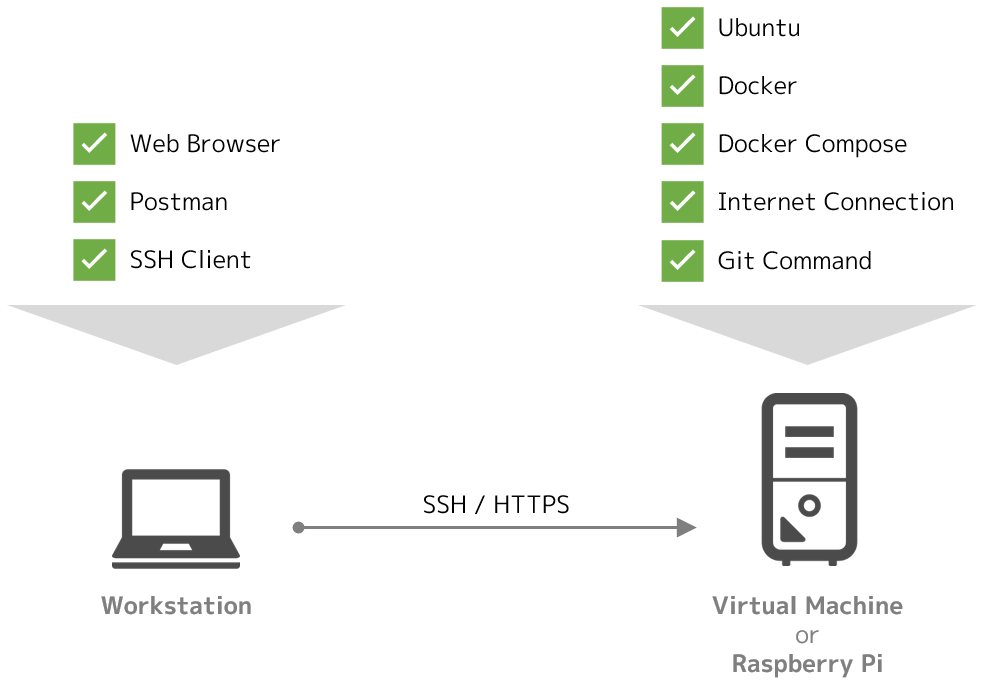

# ハンズオンラボ for Fuji release

Fuji リリース向けのハンズオンラボです。

Ubuntu 上の Docker 環境を前提に、セットアップから起動確認、デバイスサービスの構成とエクスポートまでを扱っています。

!!! tip "Fuji リリースの扱い"
    2019 年 10 月にリリースされた Fuji リリースの半年後、2020 年 4 月には、最新バージョンの **Geneva** のリリースが予定されています。Fuji からの変更点は非常に多いものの、全体の思想やアーキテクチャには、それほど大きな違いはありません。Fuji リリースに触れておけば、Geneva リリースの習得もしやすくなるはずです。
    
    ただし、コンポーネントが丸ごと別のツールに置き換わっている部分もあるため、Fuji からの変更度合いが大きい部分については、本ガイドでも適宜補足を入れています。

## ハンズオンラボのゴール

このガイドは、以下の達成を目的に執筆しています。

* EdgeX Foundry の基本的なアーキテクチャを理解する
* EdgeX Foundry の基本的な操作方法を理解する
* デバイス群からデータを収集する方法の基本を理解する
* デバイス群を操作する方法の基本を理解する
* 収集したデータを外部にエクスポートする方法の基本を理解する
* ルールエンジンを用いて、条件に応じて自動でデバイスを操作する方法の基本を理解する

## 必要なもの

このガイドでは、以下の環境を前提としています。環境の構築自体はハンズオンガイドでは取り扱わないので、それぞれのドキュメントなどを参考に導入してください。

ハンズオンは Ubuntu 上の Docker 環境を前提に進行します。**Ubuntu と Docker、Docker Compose の用意が必要** です。

Virtual Box などを利用した仮想マシンでも構いませんし、Raspberry Pi などで直接動作させた環境でも問題ありません。ただし、Raspberry Pi を利用する場合は、**3B+ または 4B** を利用（**4B を推奨**）し、メモリが 1 ～ 2 GB であれば [EdgeX Foundry の Wiki](https://wiki.edgexfoundry.org/display/FA/Running+on+a+RaspberryPi) を参照して **スワップファイルを追加** してください。

* **Ubuntu 18.04 LTS 以降（`amd64` または `arm64`）**
    * [Ubuntu Installation Guide](https://help.ubuntu.com/lts/installation-guide/amd64/index.html)
* **Docker 19.03 以降**
    * [Get Docker Engine - Community for Ubuntu](https://docs.docker.com/install/linux/docker-ce/ubuntu/)
* **Docker Compose 1.25.5 以降**
    * [Install Docker Compose](https://docs.docker.com/compose/install/)

なお、この Ubuntu 環境は、以下の条件を満たす必要があります。

* **作業用の端末から SSH などで接続してターミナルを操作できること**
* **インタネットに接続できること**
* **`git` コマンドが利用できること**

また、ラボには Web GUI や REST API の操作などを含むので、作業用の端末で以下が利用できる状態にしておくとスムーズです。

* **Web ブラウザ**
    * Google Chrome など
* **Postman**
    * [Postman | The Collaboration Platform for API Development](https://www.postman.com/)

!!! note
    ラボは基本的には Docker コンテナで完結するため、Windows でもほとんど同様に進められます。ただし、シェル環境の差異などもあるため、適宜読み替えは必要です。

## 参考リンク

ラボを進めるうえで必要な最低限の情報はガイド内に記載していますが、追加の情報が必要な場合は、以下のサイトなども参考になります。

* [EdgeX Foundry の Fuji リリースの公式ドキュメント](https://fuji-docs.edgexfoundry.org/)
    * [GitHub (`edgexfoundry`)](https://github.com/edgexfoundry)
    * [GitHub (`edgexfoundry-holding`)](https://github.com/edgexfoundry-holding)
* [Edge Xpert（商用版 EdgeX Foundry）の公式ドキュメント](http://www.iotechsys.com/cmsfiles/iotech_systems/docs/edgexpert/index.html)