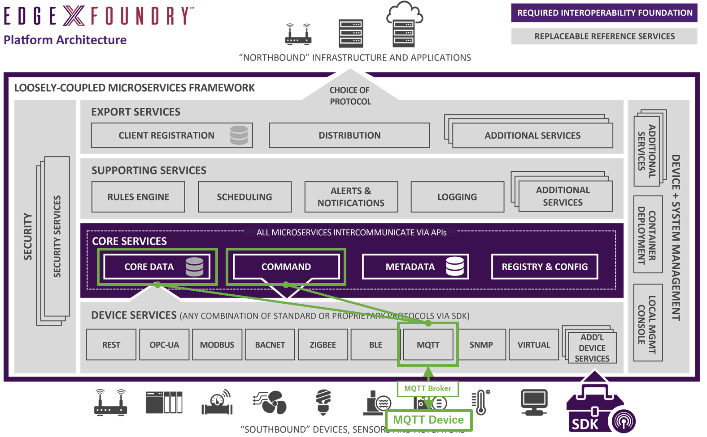
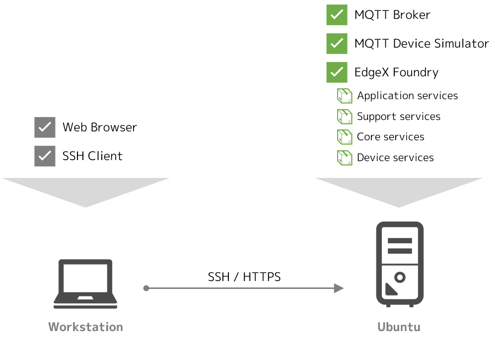
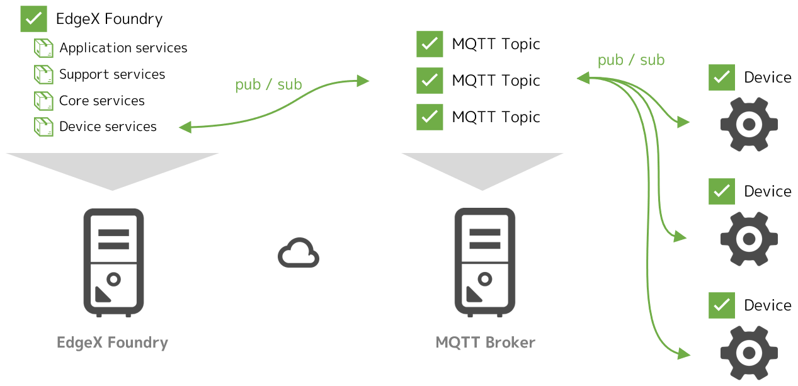
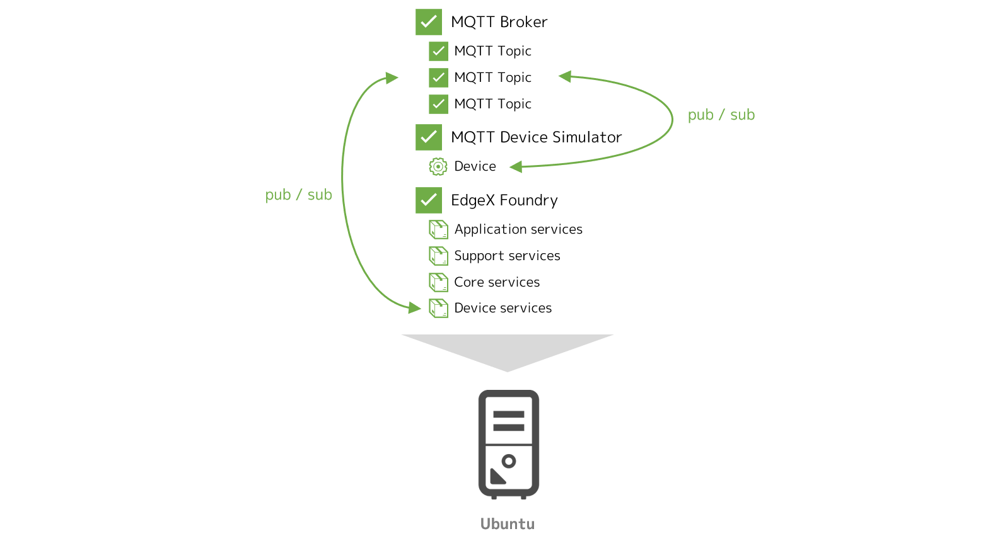
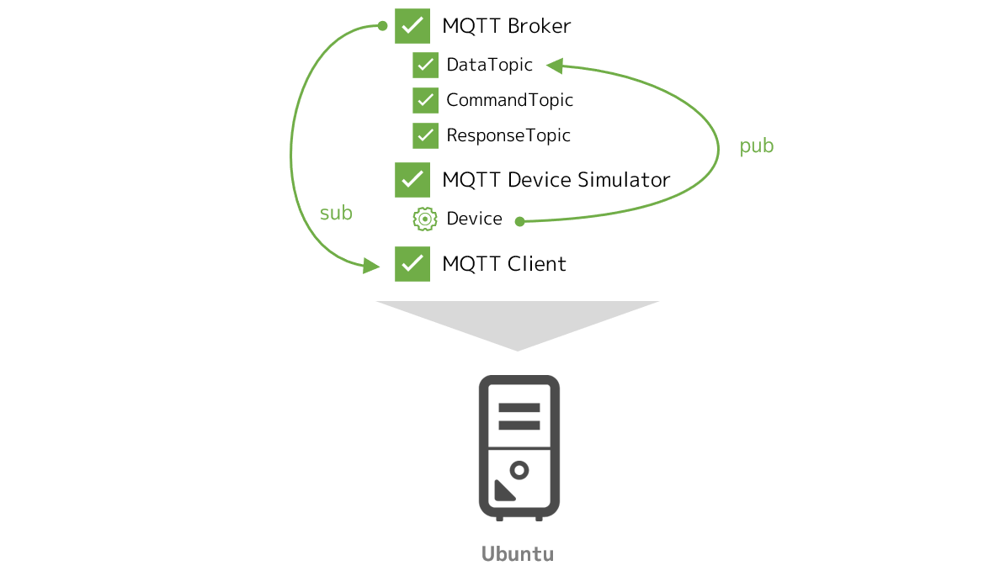
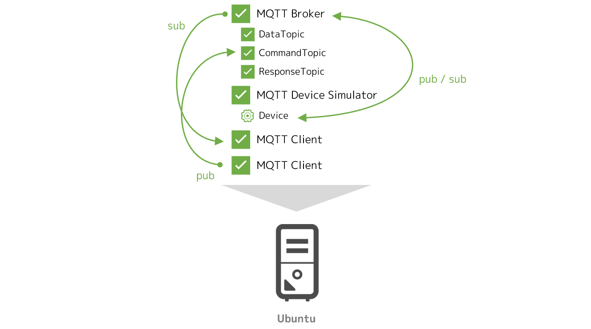
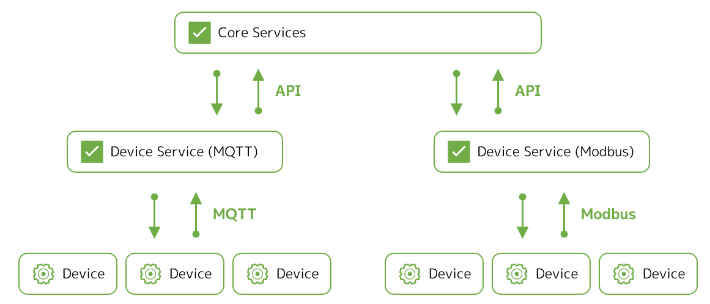
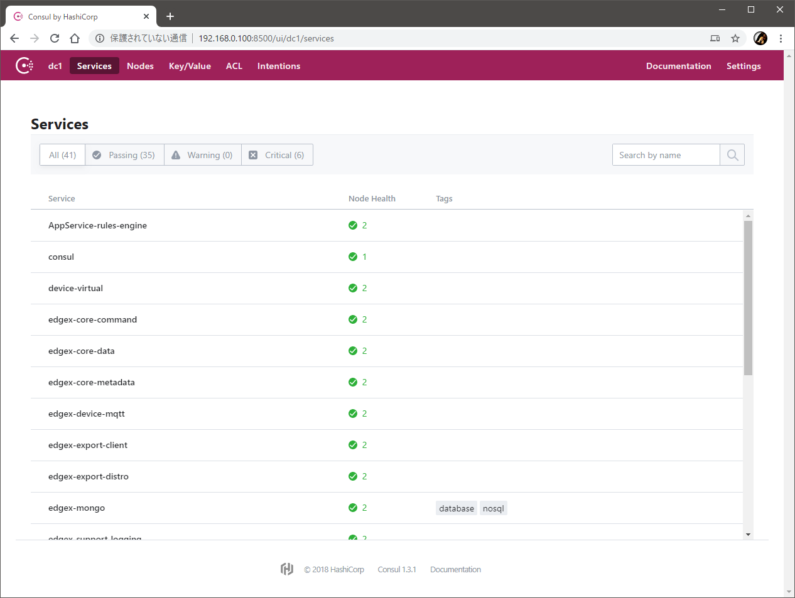
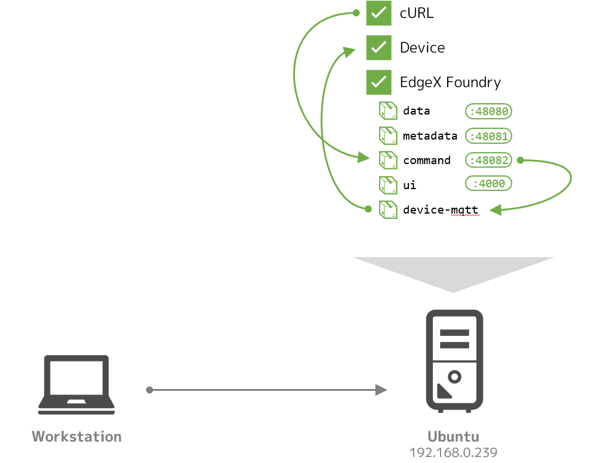
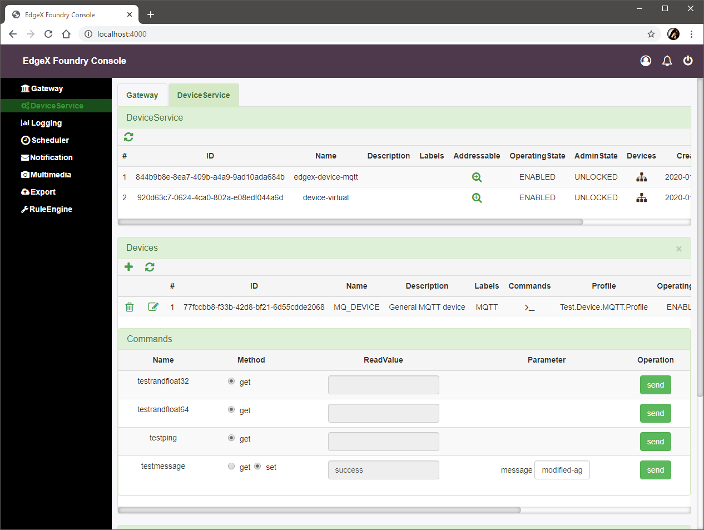

# Lab 3 - デバイスサービスの追加（MQTT）

このラボでは、EdgeX Foundry の制御下に任意のデバイスを追加する手法を実践します。

ここでは、MQTT プロトコルを利用するデバイス（のシミュレータ）を用意し、これを制御するためのデバイスサービスを構成することで、下図のように EdgeX Foundry がそのデバイスと実際に（MQTT ブローカを介して）インタラクションできる状態を構成します。




## このラボのゴールと構成

このラボの目的は次の通りです。

* デバイスサービスの概要を理解する
* デバイスサービスを用いて任意のデバイスを EdgeX Foundry の制御下に置く手法を理解する

このラボでは、Docker Compose を利用して、Ubuntu 上の Docker コンテナ群として EdgeX Foundry を起動させます。また、デバイスのシミュレータと MQTT のブローカも Docker コンテナとして起動させます。




### 必要なファイルの用意

ラボに必要なファイルは、前のラボでクローンしたリポジトリに含まれています。クローンを実施していない場合は、Ubuntu 上でクローンし、CPU のアーキテクチャに応じてディレクトリを移動してください。

=== "amd64"
    ```bash
    git clone https://github.com/kurokobo/edgex-hol-fuji.git
    cd edgex-hol-fuji
    cd amd64
    ```
=== "arm64"
    ```bash
    git clone https://github.com/kurokobo/edgex-hol-fuji.git
    cd edgex-hol-fuji
    cd arm64
    ```

このラボでは、`lab-device-service-mqtt` ディレクトリの中身を利用します。

```bash
cd lab-device-service-mqtt
ls -l
```

ファイル `docker-compose.yml` と、ディレクトリ `device-service`、`simulator` が存在しているはずです。


## 新しいデバイスの仕様と動作確認

まずは、今回新しく EdgeX Foundry の制御下におきたいデバイスの仕様を整理します。その後、実際にそのデバイスのシミュレータを動作させ、仕様通りに動くことを確認します。


### 新しいデバイスの仕様の整理

今回は、以下のような仕様のデバイスが存在するものとして、これを EdgeX Foundry の制御下に置くことを考えます。


* 二種類のセンサを持つ
    * `randfloat32`
    * `randfloat64`
* 二種類の文字列情報を持つ
    * `ping`
    * `message`
* MQTT のトピック `DataTopic` にセンサ `randfloat32` の値を 15 秒ごとに配信する
    * `{"name":"MQ_DEVICE","cmd":"randfloat32","randfloat32":"<値>"}` の形式で配信する
* MQTT のトピック `CommandTopic` を購読して、外部からのコマンドを待ち受ける
    * `{"name":"MQTT_DEVICE","method":"<get または set>","cmd":"<コマンド名>"}` の形式のコマンドを受け取る
* 外部からのコマンドを受け取ったら、コマンド応じて処理を実行し、結果を MQTT のトピック `ResponseTopic` に配信する
    * コマンドのメソッドが `set` だった場合は、保存されている `message` を書き換える
    * コマンドが `ping` だった場合は、`pong` を返す
    * コマンドが `message` だった場合は、保存されている `message` を返す
    * コマンドが `randfloat32` または `randfloat64` だった場合は、それぞれ対応するセンサの値を返す
    * 結果は `{"name":"MQ_DEVICE","method":"<メソッド>","cmd":"<コマンド名>","<コマンド名>":"<値>"}` の形式で配信する

デバイス側が定期的にデータを配信するだけでなく、外部からのコマンド操作も受け付けるようなデバイスです。ただし、二つあるセンサのうちのひとつ `randfloat64` は、値の定期的な自動での配信はしてくれません。


### ラボとしての構成

MQTT を利用するデバイスを EdgeX Foundry で管理する場合、典型的には、EdgeX Foundry のホストとは別に、MQTT ブローカと実際のデバイスが存在すると考えられます。



ただし、今回はラボなので、すべてをラボ用の Ubuntu ホスト上で Docker コンテナとして動作させてしまいます。本来の姿とは若干の乖離がある点を理解した上で進めてください。




### シミュレータの起動

このラボでは、前述の仕様に沿ったデバイスを、シミュレータを使って Docker コンテナとして用意します。

まずは、MQTT を扱うには MQTT ブローカが不可欠なので、これを起動します。起動後、`docker ps` で `STATUS` が `Up` であることを確認してください。

```bash hl_lines="1 4"
$ docker run -d --rm --name broker -p 1883:1883 eclipse-mosquitto
9e1c5939be6a9c6366c2cbdad5eae5ab5c1665062125d0a8971aa030d2116a8d

$ docker ps
CONTAINER ID        IMAGE               COMMAND                  CREATED             STATUS              PORTS                    NAMES
9e1c5939be6a        eclipse-mosquitto   "/docker-entrypoint.…"   6 seconds ago       Up 3 seconds        0.0.0.0:1883->1883/tcp   broker
```

続けて、実デバイス（のシミュレータ）の用意です。

ここでは、Node.js で MQTT を扱えるコンテナイメージ `dersimn/mqtt-scripts` を利用して、次のようなスクリプトを起動させることで、前述の仕様通りに動くシミュレータとしています。このスクリプトは、お手元の `simulator` ディレクトリ内の `mock-device.js` として保存されていますので、エディタで確認してもよいでしょう。

```js
function getRandomFloat(min, max) {
    return Math.random() * (max - min) + min;
}
 
const deviceName = "MQ_DEVICE";
let message = "test-message";
 
// 1. Publish random number every 15 seconds
schedule('*/15 * * * * *', () => {
    let body = {
        "name": deviceName,
        "cmd": "randfloat32",
        "randfloat32": getRandomFloat(25, 29).toFixed(1)
    };
    publish('DataTopic', JSON.stringify(body));
});
 
// 2. Receive the reading request, then return the response
// 3. Receive the put request, then change the device value
subscribe("CommandTopic", (topic, val) => {
    var data = val;
    if (data.method == "set") {
        message = data[data.cmd]
    } else {
        switch (data.cmd) {
            case "ping":
                data.ping = "pong";
                break;
            case "message":
                data.message = message;
                break;
            case "randfloat32":
                data.randfloat32 = getRandomFloat(25, 29).toFixed(1);
                break;
            case "randfloat64":
                data.randfloat64 = getRandomFloat(10, 1).toFixed(5);
                break;
        }
    }
    publish("ResponseTopic", JSON.stringify(data));
});
```

これを起動するには、次のように作業します。

**コマンドに MQTT ブローカを示す IP アドレスを含む** ため、ご自身の環境に合わせて **適宜書き換えて** ください。ガイド通りに EdgeX Foundry と同じホストで MQTT ブローカを動作させた場合は、EdgeX Foundry の IP アドレスと同一です。

また、CPU アーキテクチャによって利用するイメージが異なります。起動後、`docker ps` で `STATUS` が `Up` であることを確認してください。

=== "amd64"
    ```bash hl_lines="1 3 8"
    $ cd simulator

    $ docker run -d --restart=always --name=mqtt-scripts -v "$(pwd):/scripts" dersimn/mqtt-scripts --url mqtt://192.168.0.239 --dir /scripts
    Unable to find image 'dersimn/mqtt-scripts:latest' locally
    ...
    9d52b4956ebbec60dd0f93bdf9750ff915fefd8e8c58d3ce8bc7ba1429693d2b

    $ docker ps
    CONTAINER ID        IMAGE                        COMMAND                  CREATED             STATUS              PORTS                    NAMES
    13f70f88b67b        dersimn/mqtt-scripts         "node /node/index.js…"   18 seconds ago      Up 16 seconds                                mqtt-scripts
    9e1c5939be6a        eclipse-mosquitto            "/docker-entrypoint.…"   16 minutes ago      Up 16 minutes       0.0.0.0:1883->1883/tcp   broker
    ```
=== "arm64"
    ```bash hl_lines="1 3 8"
    $ cd simulator

    $ docker run -d --restart=always --name=mqtt-scripts -v "$(pwd):/scripts" dersimn/mqtt-scripts:armhf --url mqtt://192.168.0.239 --dir /scripts
    Unable to find image 'dersimn/mqtt-scripts:armhf' locally
    ...
    9d52b4956ebbec60dd0f93bdf9750ff915fefd8e8c58d3ce8bc7ba1429693d2b

    $ docker ps
    CONTAINER ID        IMAGE                        COMMAND                  CREATED             STATUS              PORTS                    NAMES
    13f70f88b67b        dersimn/mqtt-scripts:armhf   "node /node/index.js…"   18 seconds ago      Up 16 seconds                                mqtt-scripts
    9e1c5939be6a        eclipse-mosquitto            "/docker-entrypoint.…"   16 minutes ago      Up 16 minutes       0.0.0.0:1883->1883/tcp   broker
    ```


### シミュレータの動作確認

最後に、シミュレータが仕様通り動作していることを確認します。

新しいターミナルを起動して、ブローカの全トピックを購読するためのコンテナを新たに起動します。15 秒ごとにトピック `DataTopic` にセンサ `randfloat32` の値が届いていれば、動作は正常です。ここでも、**コマンドに MQTT ブローカを示す IP アドレスを含む** ため、ご自身の環境に合わせて **適宜書き換えて** ください。



```bash hl_lines="1"
$ docker run --init --rm --name=client -it kurokobo/mqtt-client sub -h 192.168.0.239 -t "#" -v
...
DataTopic {"name":"MQ_DEVICE","cmd":"randfloat32","randfloat32":"27.4"}
DataTopic {"name":"MQ_DEVICE","cmd":"randfloat32","randfloat32":"28.6"}
```

このターミナルは、今後の動作確認のためにも **起動させたまま** にします。

続けて、デバイスに対する操作ができることも確認します。追加で新しいターミナルを起動して、トピック `CommandTopic` にコマンドを配信します。これまで同様、ご自身の環境に合わせて **コマンド中の IP アドレスは適宜書き換えて** ください。

実行するごとに MQTT を購読しているターミナルを見ると、デバイスからの応答が確認できます。まずはデバイスからの情報の取得を行う `get` の動作を確認します。

```bash hl_lines="1 2 3"
$ docker run --init -it --rm kurokobo/mqtt-client pub -h 192.168.0.239 -t "CommandTopic" -m '{"name":"MQTT_DEVICE","method":"get","cmd":"ping"}'
$ docker run --init -it --rm kurokobo/mqtt-client pub -h 192.168.0.239 -t "CommandTopic" -m '{"name":"MQTT_DEVICE","method":"get","cmd":"randfloat32"}'
$ docker run --init -it --rm kurokobo/mqtt-client pub -h 192.168.0.239 -t "CommandTopic" -m '{"name":"MQTT_DEVICE","method":"get","cmd":"randfloat64"}'
```

!!! note "`failed to resize tty`"
    実行時に `failed to resize tty, using default size` のメッセージが表示される場合がありますが、無視して構いません。



購読している側では、命令が `CommandTopic` に届き、そのコマンドに応じた応答が `ResponseTopic` に配信されていることが確認できます。

```json
...
CommandTopic {"name":"MQTT_DEVICE","method":"get","cmd":"ping"}
ResponseTopic {"name":"MQTT_DEVICE","method":"get","cmd":"ping","ping":"pong"}
...
CommandTopic {"name":"MQTT_DEVICE","method":"get","cmd":"randfloat32"}
ResponseTopic {"name":"MQTT_DEVICE","method":"get","cmd":"randfloat32","randfloat32":"27.6"}
...
CommandTopic {"name":"MQTT_DEVICE","method":"get","cmd":"randfloat64"}
ResponseTopic {"name":"MQTT_DEVICE","method":"get","cmd":"randfloat64","randfloat64":"8.39883"}
...
```

同様に、デバイスを操作する `set` の動作も確認します。

```bash hl_lines="1 2 3"
$ docker run --init -it --rm kurokobo/mqtt-client pub -h 192.168.0.239 -t "CommandTopic" -m '{"name":"MQTT_DEVICE","method":"get","cmd":"message"}' 
$ docker run --init -it --rm kurokobo/mqtt-client pub -h 192.168.0.239 -t "CommandTopic" -m '{"name":"MQTT_DEVICE","method":"set","cmd":"message","message":"modified-message"}'
$ docker run --init -it --rm kurokobo/mqtt-client pub -h 192.168.0.239 -t "CommandTopic" -m '{"name":"MQTT_DEVICE","method":"get","cmd":"message"}'
```

購読している側では、`set` の実行前後で `message` コマンドの結果が変化していることが確認できます。

```json
...
CommandTopic {"name":"MQTT_DEVICE","method":"get","cmd":"message"}
ResponseTopic {"name":"MQTT_DEVICE","method":"get","cmd":"message","message":"test-message"}
...
CommandTopic {"name":"MQTT_DEVICE","method":"set","cmd":"message","message":"modified-message"}
ResponseTopic {"name":"MQTT_DEVICE","method":"set","cmd":"message","message":"modified-message"}
...
CommandTopic {"name":"MQTT_DEVICE","method":"get","cmd":"message"}
ResponseTopic {"name":"MQTT_DEVICE","method":"get","cmd":"message","message":"modified-message"}
...
```

ここまでで、デバイス（のシミュレータ）が動作している状態が作れました。

とはいえ現段階では、ただ単に前述の仕様のデバイスを論理的に作っただけで、EdgeX Foundry は全く関係ありません。ここから、このデバイスを EdgeX Foundry の制御下に置く手法を実践します。


## デバイスサービスの構成

先ほど作ったデバイスを、EdgeX Foundry の制御下におくことを考えます。


### デバイスサービスの概念

現実世界に存在するデバイスは、それぞれが異なるセンサやスイッチを持っていて、異なるプロトコルをインタフェイスに持つため、それぞれに応じた適切な方法で値の取得や制御命令の発行をする必要があります。

この実態を踏まえ、EdgeX Foundry では、実デバイスと EdgeX Foundry の間を取り持つ存在として、**デバイスサービス** とよばれるマイクロサービスを定義しています。デバイスサービスは、典型的には **プロトコルごと** または **デバイスの種類ごと** に用意します。ひとつのデバイスサービスで **ひとつ以上のデバイスを制御** できます。



デバイスサービスは、以下のような役割を持ちます。

* コアサービスに対して REST エンドポイントを提供し、デバイスからの情報取得やデバイスへの制御命令の発行を行えるようにする
* コアサービスから送られてきた制御命令を、実デバイスに合わせた命令に翻訳して実行し、実デバイスを制御する
* デバイスから送られてきた情報を、コアサービスに合わせた情報に翻訳して送信する
* 事前の定義に従って定期的にデバイスに対して特定の処理を行い、結果をコアサービスに送信する


現段階では、[**MQTT**](https://github.com/edgexfoundry/device-mqtt-go)、[**BACnet**](https://github.com/edgexfoundry/device-bacnet-c)、[**Modbus**](https://github.com/edgexfoundry/device-modbus-go)、[**REST API**](https://github.com/edgexfoundry/device-rest-go) など、IoT でよく利用されるプロトコルごとに、デバイスサービスの参考実装が提供されており、実デバイスの仕様によってはそのまま流用できることもあるでしょう。

既存の実装が利用できない場合でも、C 言語や Go 言語の [SDK が提供](https://github.com/edgexfoundry/device-sdk-go) されているため、自製が可能なほか、エコシステムが成熟すれば、IoT デバイスのメーカ側がデバイスと併せて EdgeX Foundry 用のデバイスサービスを提供するような可能性も考えられます。

いずれにせよ、すべてのデバイスサービスは、この SDK を用いたフレームワークのもとで実装されるため、実デバイスの操作方法や設定方法の差異は抽象化されます。結果的に、すべてのデバイスが共通の手法で制御できるインタフェイスを自ずと持つようになり、相互運用性を大きく高められます。これが、デバイスサービスの、ひいては EdgeX Foundry の大きなメリットのひとつです。


### デバイスサービスの構成要素

デバイスサービスの動作には、以下の 3 つの要素を考える必要があります。

* **デバイスプロファイル**（Device Profile）
    * YAML ファイルとして定義する
    * 管理対象のデバイスが持つリソースや、そのリソースが持つ値の意味、それぞれのリソースに対して行える操作などを定義する
* **デバイスサービスコンフィグレーション**（Drvice Service Configuration）
    * `configuration.toml` ファイルとして定義する
    * デバイスプロファイルと実際のデバイスを紐づけて、EdgeX Foundry のデバイスとして定義する。デバイスやリソースに対する自動実行処理なども定義する
    * その他、デバイスサービスの動作に必要なパラメータを指定する
* **デバイスサービスそのもの**
    * 今回はコンテナとして MQTT を利用できるデバイスサービス `edgex-device-mqtt` を利用する
    * デバイスプロファイルとデバイスサービスコンフィグレーションを読み込んで動作する


### デバイスプロファイル

今回利用するデバイスプロファイルは、お手元の `device-service` ディレクトリ内の `mqtt.test.device.profile.yml` です。以下の内容を含んでいます。エディタで確認してもよいでしょう。

```yaml
name: "Test.Device.MQTT.Profile"
manufacturer: "Dell"
model: "MQTT-2"
labels:
- "test"
description: "Test device profile"
 
deviceResources:
- name: randfloat32
  description: "device random number with Base64 encoding"
  properties:
    value:
      { type: "Float32", size: "4", readWrite: "R", defaultValue: "0.00", minimum: "100.00", maximum: "0.00", floatEncoding: "Base64" }
    units:
      { type: "String", readWrite: "R", defaultValue: "" }
- name: randfloat64
  description: "device random number with e notion"
  properties:
    value:
      { type: "Float64", size: "4", readWrite: "R", defaultValue: "0.00", minimum: "100.00", maximum: "0.00", floatEncoding: "eNotation" }
    units:
      { type: "String", readWrite: "R", defaultValue: "" }
- name: ping
  description: "device awake"
  properties:
    value:
      { type: "String", size: "0", readWrite: "R", defaultValue: "oops" }
    units:
      { type: "String", readWrite: "R", defaultValue: "" }
- name: message
  description: "device notification message"
  properties:
    value:
      { type: "String", size: "0", readWrite: "W" ,scale: "", offset: "", base: ""  }
    units:
      { type: "String", readWrite: "R", defaultValue: "" }
 
deviceCommands:
- name: testrandfloat32
  get:
    - { index: "1", operation: "get", deviceResource: "randfloat32"}
- name: testrandfloat64
  get:
    - { index: "1", operation: "get", deviceResource: "randfloat64"}
- name: testping
  get:
    - { index: "1", operation: "get", deviceResource: "ping"}
- name: testmessage
  get:
    - { index: "1", operation: "get", deviceResource: "message"}
  set:
    - { index: "1", operation: "set", deviceResource: "message"}
 
coreCommands:
- name: testrandfloat32
  get:
    path: "/api/v1/device/{deviceId}/testrandfloat32"
    responses:
    - code: "200"
      description: "get the random float32 value"
      expectedValues: ["randfloat32"]
    - code: "500"
      description: "internal server error"
      expectedValues: []
- name: testrandfloat64
  get:
    path: "/api/v1/device/{deviceId}/testrandfloat64"
    responses:
    - code: "200"
      description: "get the random float64 value"
      expectedValues: ["randfloat64"]
    - code: "500"
      description: "internal server error"
      expectedValues: []
- name: testping
  get:
    path: "/api/v1/device/{deviceId}/testping"
    responses:
    - code: "200"
      description: "ping the device"
      expectedValues: ["ping"]
    - code: "500"
      description: "internal server error"
      expectedValues: []
- name: testmessage
  get:
    path: "/api/v1/device/{deviceId}/testmessage"
    responses:
    - code: "200"
      description: "get the message"
      expectedValues: ["message"]
    - code: "500"
      description: "internal server error"
      expectedValues: []
  put:
    path: "/api/v1/device/{deviceId}/testmessage"
    parameterNames: ["message"]
    responses:
    - code: "204"
      description: "set the message."
      expectedValues: []
    - code: "500"
      description: "internal server error"
      expectedValues: []
```

デバイスプロファイルは、冒頭に `manufacturer` と `model` があるように、典型的にはデバイスのモデルや型番ごとにひとつ用意します。そのモデルや型番のデバイスが、

* どのようなセンサやアクチュエータを持ち、値の意味はなにか（`deviceResources` セクション）
* それぞれのセンサやアクチュエータに対してできる操作はなにか（`deviceCommands` セクション）
* コアサービスにそれらの操作をどのように公開するか（`coreCommands` セクション）

を定義します。

今回の例では、`deviceResources` セクションを見ると、例えば、

* このデバイスにリソース `randfloat64` があり
* それは `0.00` から `100.00` の範囲の
* `Float64` 型の値を持つ

ことなどが定義されています。また、`message` リソースは `String` 型の値を持ち、他のリソースと違って書き換えが可能（`W`）と定義されています。

`deviceCommands` セクションでは、例えば `testrandfloat64` コマンドを定義し、このコマンドの `get` メソッドでは、先に `deviecResources` で定義したリソース `randfloat64` からの値の読み取りを行うことなどが定義されています。また、`testmessage` コマンドでは、`message` リソースに対する`get` だけでなく、`set` メソッドも定義しています。

!!! tip "複数リソースの同時操作"
    ここでは実装されていませんが、ひとつのメソッドに複数のリソースを紐付けることも可能です。つまり、一回の `get` 操作で複数のリソースの値を同時に取得するようにも構成できます。[Edge Xpert のドキュメントでは、そのような例が解説され](http://www.iotechsys.com/cmsfiles/iotech_systems/docs/edgexpert/device-services/Ch-DeviceProfiles.html) ています。

`coreCommands` セクションでは、例えばコアサービスが `testrandfloat64` コマンドを実行でき、その `GET` リクエストはパス `/api/v1/device/{deviceId}/testrandfloat64` に渡される（このパスは、先の `deviceCommands` で定義した `testrandfloat64` コマンドのことです）ものと定義されています。そして、結果のレスポンスコード `200` だった場合は、そのレスポンスのボディに含まれる値がリソース `randfloat32` の値として取り扱えるものであることが定義されています。また、`testmessage` コマンドでは、ほかのコマンドと異なり `PUT` リクエストの動作も定義されています。


### デバイスサービスコンフィグレーション

今回利用するデバイスサービスコンフィグレーションファイルは、お手元の `device-service` ディレクトリ内の `configuration.toml` です。

このファイルは **MQTT ブローカの IP アドレスを含む** ので、**IP アドレス部分 `192.168.0.239` をご自身の環境に合わせて修正し上書き** してください。

```toml
# configuration.toml
[Writable]
LogLevel = 'DEBUG'

[Service]
Host = "edgex-device-mqtt"
Port = 49982
ConnectRetries = 3
Labels = []
OpenMsg = "device mqtt started"
Timeout = 5000
EnableAsyncReadings = true
AsyncBufferSize = 16

[Registry]
Host = "edgex-core-consul"
Port = 8500
CheckInterval = "10s"
FailLimit = 3
FailWaitTime = 10
Type = "consul"

[Logging]
EnableRemote = false
File = "./device-mqtt.log"

[Clients]
  [Clients.Data]
  Name = "edgex-core-data"
  Protocol = "http"
  Host = "edgex-core-data"
  Port = 48080
  Timeout = 50000

  [Clients.Metadata]
  Name = "edgex-core-metadata"
  Protocol = "http"
  Host = "edgex-core-metadata"
  Port = 48081
  Timeout = 50000

  [Clients.Logging]
  Name = "edgex-support-logging"
  Protocol = "http"
  Host ="edgex-support-logging"
  Port = 48061

[Device]
  DataTransform = true
  InitCmd = ""
  InitCmdArgs = ""
  MaxCmdOps = 128
  MaxCmdValueLen = 256
  RemoveCmd = ""
  RemoveCmdArgs = ""
  ProfilesDir = "/custom-config"

# Pre-define Devices
[[DeviceList]]
  Name = "MQ_DEVICE"
  Profile = "Test.Device.MQTT.Profile"
  Description = "General MQTT device"
  Labels = [ "MQTT"]
  [DeviceList.Protocols]
    [DeviceList.Protocols.mqtt]
       Schema = "tcp"
       Host = "192.168.0.239"
       Port = "1883"
       ClientId = "CommandPublisher"
       User = ""
       Password = ""
       Topic = "CommandTopic"
  [[DeviceList.AutoEvents]]
    Frequency = "30s"
    OnChange = false
    Resource = "testrandfloat64"

# Driver configs
[Driver]
IncomingSchema = "tcp"
IncomingHost = "192.168.0.239"
IncomingPort = "1883"
IncomingUser = ""
IncomingPassword = ""
IncomingQos = "0"
IncomingKeepAlive = "3600"
IncomingClientId = "IncomingDataSubscriber"
IncomingTopic = "DataTopic"
ResponseSchema = "tcp"
ResponseHost = "192.168.0.239"
ResponsePort = "1883"
ResponseUser = ""
ResponsePassword = ""
ResponseQos = "0"
ResponseKeepAlive = "3600"
ResponseClientId = "CommandResponseSubscriber"
ResponseTopic = "ResponseTopic"
```

このファイルでは、前半部分でデバイスサービス自身の動作に必要なパラメータを指定しています。後半部分では、デバイスプロファイルと実際のデバイスを紐づけて、EdgeX Foundry のデバイスとして定義しています。

デバイスを定義している部分は、``[[DeviceList]]`` です。デバイスプロファイル `Test.Device.MQTT.Profile` に紐づけて、デバイス `MQ_DEVICE` の存在を定義しています。また、このデバイスに対するコマンドの実行に利用する MQTT ブローカも指定しています。

ここに含まれる `[[DeviceList.AutoEvents]]` の部分では、デバイスに対するコマンドの定期実行を定義しています。今回利用するデバイスのリソース `randfloat64` は、デバイスサービスに値を自動では送らないため、データを収集するにはデバイスサービス側から定期的に確認しに行く必要があります。今回は、`30` 秒ごとに `testrandfloat64` コマンドを実行するように設定しています。

最後の `[Driver]` の部分では、デバイスサービスがデバイスから情報を受け取るために購読する MQTT ブローカやトピック名を設定しています。

!!! tip "あとからのデバイスの追加"
    `configuration.toml` はデバイスサービスの **起動時の構成** を指定するものです。起動後にデバイスを追加したい場合は、このファイルではなく [API を利用して追加](https://fuji-docs.edgexfoundry.org/Ch-WalkthroughProvision.html) できます。

!!! note "他のデバイスサービスの場合"
    今回のファイルは、あくまで **MQTT デバイスサービス専用** の設定ファイルなので、利用したいデバイスサービスが違えば、当然この設定ファイルで書くべき内容も変わることに注意が必要です。


### デバイスサービスを含んだ EdgeX Foundry の起動

設定ファイルができたら、デバイスサービスを含む EdgeX Foundry を起動します。

お手元にある今回用の `docker-compose.yml` は、デバイスサービスを起動するための記述として、以下を追加しています。エディタで確認してもよいでしょう。

=== "amd64"
    ```yaml
      device-mqtt:
        image: edgexfoundry/docker-device-mqtt-go:1.1.1
        ports:
          - "49982:49982"
        container_name: edgex-device-mqtt
        hostname: edgex-device-mqtt
        networks:
          - edgex-network
        volumes:
          - db-data:/data/db
          - log-data:/edgex/logs
          - consul-config:/consul/config
          - consul-data:/consul/data
          - ./device-service:/custom-config
        depends_on:
          - data
          - command
        entrypoint:
          - /device-mqtt
          - --registry=consul://edgex-core-consul:8500
          - --confdir=/custom-config
    ```
=== "arm64"
    ```yaml
      device-mqtt:
        image: edgexfoundry/docker-device-mqtt-go-arm64:1.1.1
        ports:
          - "49982:49982"
        container_name: edgex-device-mqtt
        hostname: edgex-device-mqtt
        networks:
          - edgex-network
        volumes:
          - db-data:/data/db
          - log-data:/edgex/logs
          - consul-config:/consul/config
          - consul-data:/consul/data
          - ./device-service:/custom-config
        depends_on:
          - data
          - command
        entrypoint:
          - /device-mqtt
          - --registry=consul://edgex-core-consul:8500
          - --confdir=/custom-config
    ```

これにより、`edgexfoundry/docker-device-mqtt-go` イメージを利用してデバイスサービスが起動します。

また、今回用の設定ファイルが含まれるお手元の `device-service` ディレクトリを、コンテナ内の `/custom-config` にマウントし、起動時の引数で `--confdir=/custom-config` を与えています。これでデバイスサービスの起動時にお手元の設定ファイル群が読み込まれるようになり、EdgeX Foundry にデバイスサービスとデバイスが登録されます。

!!! tip "設定ファイルのマウント"
    今回の手法は、他のデバイスサービスを利用する場合も応用できます。設定ファイルを含んだコンテナイメージをビルドして使うことも手ですが、設定ファイルの修正が相当な手間になってしまうため、日常的に書き換えうるファイルは後からマウントして利用させる工夫が有効です。

実際にこのファイルを利用して EdgeX Foundry を起動させ、`State` が `Up` になることを確認します。

```bash hl_lines="1 3"
$ docker-compose up -d

$ docker-compose ps
```

!!! tip "マイクロサービスの起動状態"
    EdgeX Foundry は、マイクロサービス群の状態管理に [HashiCorp の Consul](https://www.consul.io/) を利用しており、各サービスの起動状態や登録状態は、この Consul を通じても確認できます。

    

    Consul の GUI には、`http://<IP アドレス>:8500/` でアクセスでき、サービスの状態のほか、構成情報（Key-Value ストアの中身）も確認できます。


## 動作確認

まずは、デバイスサービスやデバイスが正常に EdgeX Foundry に認識されているか確認し、その後、値の収集やコマンド操作を確認します。


### 登録状態の確認

Web GUI を利用して、登録状態を確認します。

1. Docker ホストの IP アドレスを確認して、`http://<IP アドレス>:4000/` にブラウザでアクセスし、デフォルトのユーザ `admin`（パスワードも `admin`）でログインします。
1. [`Gateway`] に Docker ホストを登録して選択状態にしてから、[`Device Service`] に遷移します。
1. デバイスサービス `edgex-device-mqtt` が登録されていることを確認します。
1. デバイスサービス `edgex-device-mqtt` の行の [`Devices`] アイコンを展開して、デバイス `MQ_DEVICE` が登録されていることを確認します。
1. デバイス `MQ_DEVICE` の行の [`Commands`] アイコンを展開して、`testrandfloat32` など、4 つのコマンドが登録されていることを確認します。

API でも、同様の確認を行えます。API でデバイスサービスやデバイスの登録状態を確認する場合は、リクエスト先は `metadata` サービス（`48081` 番ポート）です。


```json hl_lines="1 28"
$ curl -s  http://localhost:48081/api/v1/deviceservice | jq
...
  {
    "created": 1588154133422,
    "modified": 1588154133422,
    "origin": 1588154133416,
    "id": "e2699690-fd1f-4d95-b3ad-0053c7c03f26",
    "name": "edgex-device-mqtt",
    "operatingState": "ENABLED",
    "addressable": {
      "created": 1588154133414,
      "modified": 1588154133414,
      "origin": 1588154133411,
      "id": "75d0e02f-1ab7-43f7-b1fa-d4a10858a177",
      "name": "edgex-device-mqtt",
      "protocol": "HTTP",
      "method": "POST",
      "address": "edgex-device-mqtt",
      "port": 49982,
      "path": "/api/v1/callback",
      "baseURL": "http://edgex-device-mqtt:49982",
      "url": "http://edgex-device-mqtt:49982/api/v1/callback"
    },
    "adminState": "UNLOCKED"
  }
...

$ curl -s  http://localhost:48081/api/v1/device | jq
...
  {
    "created": 1588154134502,
    "modified": 1588154134502,
    "origin": 1588154134456,
    "description": "General MQTT device",
    "id": "1b715850-b4ee-420e-b4cb-bb65577fa2a4",
    "name": "MQ_DEVICE",
    "adminState": "UNLOCKED",
    "operatingState": "ENABLED",
    "protocols": {
      "mqtt": {
        "ClientId": "CommandPublisher",
        "Host": "192.168.0.239",
        "Password": "",
        "Port": "1883",
        "Schema": "tcp",
        "Topic": "CommandTopic",
        "User": ""
      }
...
```


### デバイスから配信された値の蓄積の確認

今回のデバイスは、センサ `randfloat32` の値を `15` 秒ごとに自動的に MQTT トピックに配信していました。デバイスサービスはこれを受け取れるように構成したので、EdgeX Foundry にも取り込まれているはずです。

`data` サービスの API を利用して、これを確認します。

```json hl_lines="1"
$ curl -s http://localhost:48080/api/v1/reading/name/randfloat32/3 | jq
[
  {
    "id": "23fdac76-0870-4b9d-b653-561d8a7c0423",
    "created": 1579707885029,
    "origin": 1579707885005379300,
    "modified": 1579707885029,
    "device": "MQ_DEVICE",
    "name": "randfloat32",
    "value": "QdpmZg=="
  },
  {
    "id": "5c086b1d-6b38-48c0-9aef-9b800f9c72ab",
    "created": 1579707870018,
    "origin": 1579707870004742000,
    "modified": 1579707870018,
    "device": "MQ_DEVICE",
    "name": "randfloat32",
    "value": "QeGZmg=="
  },
  {
    "id": "de67c865-0406-408d-b238-d33de1fe1032",
    "created": 1579707855022,
    "origin": 1579707855011006200,
    "modified": 1579707855022,
    "device": "MQ_DEVICE",
    "name": "randfloat32",
    "value": "Qd2Zmg=="
  }
]
```

時刻はエポックミリ秒（`origin` はエポックナノ秒）なので、`date` コマンドで変換すると 15 秒おきであることが確認できます。

```bash
$ date -d "@1579707885.029"
Wed 22 Jan 2020 03:44:45 PM UTC
 
$ date -d "@1579707870.018"
Wed 22 Jan 2020 03:44:30 PM UTC
 
$ date -d "@1579707855.022"
Wed 22 Jan 2020 03:44:15 PM UTC
```


### デバイスサービスの自動実行イベントの確認

センサ `randfloat64` の値は、自動では配信されないため、デバイスサービスの設定（`configuration.toml`）に `[[DeviceList.AutoEvents]]` を定義して、デバイスサービス側から `30` 秒ごとに自動で収集させていました。

これもデータの蓄積を確認できるはずです。

```json hl_lines="1"
$ curl -s http://localhost:48080/api/v1/reading/name/randfloat64/3 | jq
[
  {
    "id": "c99bd0bc-14f7-46b6-a940-ed26f7738bdb",
    "created": 1579709342807,
    "origin": 1579709342806935600,
    "modified": 1579709342807,
    "device": "MQ_DEVICE",
    "name": "randfloat64",
    "value": "8.047360e+00"
  },
  {
    "id": "68c36823-ca73-4033-8f40-a2d82088f644",
    "created": 1579709312695,
    "origin": 1579709312695223100,
    "modified": 1579709312695,
    "device": "MQ_DEVICE",
    "name": "randfloat64",
    "value": "2.020540e+00"
  },
  {
    "id": "b9fceb6a-6ee3-4f20-aed5-2dab8c0db9c4",
    "created": 1579709282612,
    "origin": 1579709282611878800,
    "modified": 1579709282612,
    "device": "MQ_DEVICE",
    "name": "randfloat64",
    "value": "4.781700e+00"
  }
]
```

これも変換すると 30 秒おきであることが確認できます。

```bash
$ date -d "@1579709342.807"
Wed Jan 22 16:09:02 UTC 2020
 
$ date -d "@1579709312.695"
Wed Jan 22 16:08:32 UTC 2020
 
$ date -d "@1579709282.612"
Wed Jan 22 16:08:02 UTC 2020
```

MQTT ブローカを購読しているターミナルでは、`DataTopic` への自動配信に混ざって、30 秒ごとに `CommandTopic` にコマンドが届き、`ResponseTopic` に応答が返されていることが観察できるでしょう。

```bash hl_lines="1"
$ docker run --init --rm --name=client -it kurokobo/mqtt-client sub -h 192.168.0.239 -t "#" -v
...
CommandTopic {"cmd":"randfloat64","method":"get","uuid":"5ea957f9b8dd790001fce499"}
ResponseTopic {"cmd":"randfloat64","method":"get","uuid":"5ea957f9b8dd790001fce499","randfloat64":"4.17029"}
...
CommandTopic {"cmd":"randfloat64","method":"get","uuid":"5ea95817b8dd790001fce49a"}
ResponseTopic {"cmd":"randfloat64","method":"get","uuid":"5ea95817b8dd790001fce49a","randfloat64":"7.36756"}
...
```


### デバイスへのコマンド実行の確認

このデバイスのリソース `message` の値は、EdgeX Foundry から制御できるように、デバイスプロファイルでも `PUT` リクエストの挙動を定義していました。ここでは、この操作ができることを確認します。

デバイスプロファイルで定義した各コマンドは、`command` サービス経由で利用できます。実行用の URL は、`command` サービスの API で確認できます。

`command` サービス（`48082` 番ポート）にデバイスの情報を問い合わせると、レスポンスにコマンドを実行するための URL が含まれます。結果から、`testmessage` コマンドの情報を特定し、`get` と `put` の `url` を探します。

```json hl_lines="1"
$ curl -s http://localhost:48082/api/v1/device/name/MQ_DEVICE | jq
...
  "id": "77fccbb8-f33b-42d8-bf21-6d55cdde2068",
  "name": "MQ_DEVICE",
...
  "commands": [
...
      "name": "testmessage",
...
      "get": {
        "path": "/api/v1/device/{deviceId}/testmessage",
...
        "url": "http://edgex-core-command:48082/api/v1/device/77fccbb8-f33b-42d8-bf21-6d55cdde2068/command/4daa4148-7c0e-4cfd-81cc-b2b740bb4de4"
      },
      "put": {
        "path": "/api/v1/device/{deviceId}/testmessage",
...
        "url": "http://edgex-core-command:48082/api/v1/device/77fccbb8-f33b-42d8-bf21-6d55cdde2068/command/4daa4148-7c0e-4cfd-81cc-b2b740bb4de4",
...
```

EdgeX Foundry がデバイスにコマンドを実行するときは、内部ではこの URL に対して `GET` や `PUT` が行われます。URL のとおり、`command` サービスがホストです。`command` サービスがリクエストを受け取ると、デバイスサービスにリクエストを渡し、デバイスサービスはそれを受け取って事前の設定に従ってデバイスに作用し、応答が返ってくることになります。

ここでは実際に、確認できた URL にリクエストを発行します。外部からこの URL を直接叩くときは、**ホスト名部分を環境に合わせて書き換え** たうえで実行します。

まずは、現在値を確認します。`get` コマンドの URL のホスト名を `localhost` に修正して、`GET` リクエストを送ります。

```bash
$ curl -s http://localhost:48082/api/v1/device/77fccbb8-f33b-42d8-bf21-6d55cdde2068/command/4daa4148-7c0e-4cfd-81cc-b2b740bb4de4 | jq
{
  "device": "MQ_DEVICE",
  "origin": 1579710432121478400,
  "readings": [
    {
      "origin": 1579710432109675800,
      "device": "MQ_DEVICE",
      "name": "message",
      "value": "modified-message"
    }
  ],
  "EncodedEvent": null
}
```



まだ何も変更していないので、初期値（`mqtt-script.js` で定義されている）か、または動作確認で変更したあとの文字列（上記では `modified-message`）が返ってきました。

ここで、変更するための `PUT` を投げます。先ほど確認した `put` の URL（実は `get` と同じですが）のホスト名を `localhost` に修正して、リクエストのボディに JSON を含めて `PUT` します。

```bash
$ curl -s -X PUT -d '{"message":"control-from-edgex"}' http://localhost:48082/api/v1/device/77fccbb8-f33b-42d8-bf21-6d55cdde2068/command/4daa4148-7c0e-4cfd-81cc-b2b740bb4de4
```

エラーがなければ、再度 `GET` すると、値が変わっていることが確認できます。

```bash
$ curl -s http://localhost:48082/api/v1/device/77fccbb8-f33b-42d8-bf21-6d55cdde2068/command/4daa4148-7c0e-4cfd-81cc-b2b740bb4de4 | jq
{
  "device": "MQ_DEVICE",
  "origin": 1579710963293832000,
  "readings": [
    {
      "origin": 1579710963283338200,
      "device": "MQ_DEVICE",
      "name": "message",
      "value": "control-from-edgex"
    }
  ],
  "EncodedEvent": null
}
```

なお、このような `GET` や `PUT` に相当する操作は、GUI からも実行できます。



!!! tip "GUI からの操作"
    GUI からの `get` や `set` 操作は、たまにうまく動かないことがあります。ほとんどの場合、ブラウザをリロードして再試行すると成功します。


## 環境の停止

後続のラボでは、現在利用しているものとは別の `docker-compose.yml` ファイルを利用しますので、今回のこの環境はクリーンアップします。

次のコマンドで、作成したコンテナと、自動で作成された永続ボリューム領域を削除します。

```bash hl_lines="1"
$ docker-compose down --volumes
Stopping edgex-ui-go                          ... done
...
Removing image portainer/portainer
```

また、動作させている MQTT ブローカとデバイスのシミュレータも停止させます。MQTT トピックを購読しているターミナルが残っていれば、++ctrl+c++ で終了します。

```bash hl_lines="1 3"
$ docker stop broker

$ docker rm -f mqtt-scripts
```

不要なコンテナが残っていないことを確認します。

```bash hl_lines="1"
$ docker ps -a
CONTAINER ID        IMAGE               COMMAND             CREATED             STATUS              PORTS               NAMES
```


## まとめ

このラボでは、以下を取り扱いました。

* デバイスサービスの概要と、その構成要素を確認しました
* デバイスサービスを用いて、MQTT を利用するデバイスを EdgeX Foundry の制御下に置く手法を実践しました

実際のユースケースでは、本当のデバイスの本当の仕様に合わせてデバイスサービスや設定ファイル群を構成する必要があります。場合によってはデバイスサービスそれ自体の実装を含めて開発が必要になる可能性もありますが、SDK を使ってゼロから開発するほか、既存の各プロトコル用のデバイスサービスの実装も参考にできるでしょう。

なお、このラボでは MQTT 用のデバイスサービスを取り上げましたが、公式ドキュメントには [他のプロトコル用のデバイスサービスのチュートリアル](https://fuji-docs.edgexfoundry.org/Ch-Examples.html) が含まれています。また、各デバイスサービスの Git リポジトリ（[MQTT](https://github.com/edgexfoundry/device-mqtt-go)、[BACnet](https://github.com/edgexfoundry/device-bacnet-c)、[Modbus](https://github.com/edgexfoundry/device-modbus-go)、[REST API](https://github.com/edgexfoundry/device-rest-go) など）に含まれる `README.md` も参考にできます。
